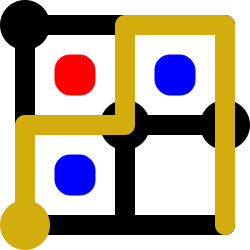

# SVG Tiler

**SVG Tiler** is a tool for drawing diagrams on a grid,
where you draw ASCII art or spreadsheets and SVG Tiler automatically
subsitutes each character or cell with a corresponding SVG symbol
to make a big SVG figure
(in an efficient representation that factors out repeated symbols),
and optionally converts it to PDF, PNG, and/or LaTeX for LaTeX text.
Here are a few examples of generated figures;
see [more examples below](#examples).

| [Super Mario Bros.](examples/mario) | [The Witness](examples/witness) |
| --- | --- |
| [](examples/mario) | [](examples/witness) |

## Main Concepts

To use SVG Tiler, you combine at least two types of files
(possibly multiple of each type):

1. A **mapping file** specifies how to map symbol names (strings) to
   SVG content (either embedded in the same file or in separate files).
   Mapping files can be specified in a simple ASCII format, or
   as a dynamic mapping defined by JavaScript or CoffeeScript code.
   
2. A **drawing file** specifies a grid of symbol names (strings) which,
   combined with one or more mapping files to define the SVG associated
   with each symbol, compile to a single (tiled) SVG.
   Drawing files can be specified as
   ASCII art (where each symbol is limited to a single character),
   space-separated ASCII art (where symbols are separated by whitespace),
   standard CSV/TSV (comma/tab-separated) tabular formats, or
   standard multi-sheet spreadsheet formats XLSX/XLS/ODS
   supported by Google Sheets, OfficeOffice, and Excel.

3. An optional **style file** specifies global styling of SVG elements via
   [CSS](https://developer.mozilla.org/en-US/docs/Web/SVG/Tutorial/SVG_and_CSS)
   or [Stylus](https://stylus-lang.com/).

Here's a simple full example from
[Tetris in the pixel-art style of the NES game](examples/tetris):

<table>
<tr>
<th>Input mapping
<br>(.txt format)
<th>Input drawing
<br>(.asc format)
<th>Output
<br>(.png format)
<tr>
<td>

```
T NES_level7_empty.png
O NES_level7_empty.png
I NES_level7_empty.png
J NES_level7_filled.png
S NES_level7_filled.png
L NES_level7_other.png
Z NES_level7_other.png
  <rect fill="black" width="8" height="8"/>
```

PNG image files referenced above:   

<td>

```
I           
I          Z
ILJJJOO SSZZ
ILLLJOOSS Z 
```

<td>


</table>

## Usage

Normally, you run `svgtiler` on the command line, listing
all input files (mapping, drawing, and style files) as arguments.
Mapping and style files apply to all drawing files listed later.
File types and formats are distinguished automatically by their extension,
as listed below.
For example:

```
svgtiler map1.txt map2.coffee drawing.asc drawings.xlsx
```

will generate `drawing.svg` using the mappings in `map1.txt` and `map2.coffee`,
and will generate `drawings_<sheet>.svg` for each unhidden sheet in
`drawings.xlsx`.

Alternatively, you can use the [SVG Tiler API](#api) to render SVG from your
own JavaScript code, e.g., converting ASCII art embedded within a webpage
into SVG drawings.

## Mapping Files: .txt, .js, .coffee, .jsx, .cjsx

In the **.txt format** for mapping files, each line consists of a symbol name
(either having no spaces, or consisting entirely of a single space),
followed by whitespace, followed by either a block of SVG code
(such as `<symbol viewBox="...">...</symbol>`) or a filename containing
such a block.  For example, here is a mapping of `O` to black squares
and both ` ` (space) and empty string to blank squares, all dimensioned
50 &times; 50:

```svg
O <symbol viewBox="0 0 50 50"><rect width="50" height="50"/></symbol>
  <symbol viewBox="0 0 50 50"></symbol>
 <symbol viewBox="0 0 50 50"></symbol>
```

Here is a mapping of the same symbols to external files:

```
O O.svg
  blank.svg
 blank.svg
```

In the **.js / .coffee / .jsx / .cjsx formats**, the file consists of
JavaScript / CoffeeScript code, the last line of which should evaluate to either

1. an *object* whose keys are symbol names, or
2. a *function* in one argument, a symbol name (string).
   (This feature allows you to parse symbol names how you want; or check an
    object for a matching key but use a default value otherwise; etc.).

The object or function should map a symbol name to either

1. a string of SVG code (detected by the presence of a `<` character),
2. [Preact](https://preactjs.com/) (React-style) Virtual DOM elements, via
   [JSX](https://reactjs.org/docs/introducing-jsx.html) syntax
   (or its [CoffeeScript analog](https://coffeescript.org/#jsx))
   or via `preact.h` calls
   (see [the polyomino example](examples/polyomino)),
   Be careful not to modify Preact nodes, as they get re-used; instead use
   [`preact.cloneElement`](https://preactjs.com/guide/v10/api-reference/#cloneelement)
   to make a modified copy (or before modification).
3. a filename with `.svg` extension containing SVG code,
4. a filename with `.png`, `.jpg`, `.jpeg`, or `.gif` extension containing an
   image (which will get [processed](#image-processing) as an `<image>`), or
5. a function returning one of the above.

In the last case, the function is called *for each occurrence of the symbol*,
and has `this` bound to a manufactured `Context` object, giving you access to
the following properties:

* `this.key` is the symbol name, or `null` if the `Context` is out of bounds
  of the drawing.
* `this.includes(substring)` computes whether `this.key` contains the given
  `substring` (as would `this.key.includes(substring)` in ECMAScript 2015).
* `this.match(regex)` matches `this.key` against the given regular
  expression (a shortcut for `this.key.matches(regex)`).
* `this.i` is the row number of the cell of this symbol occurrence (starting
  at 0).
* `this.j` is the column number of the cell of this symbol occurrence
  (starting at 0).
* `this.neighbor(dj, di)` returns a new `Context` for row `i + di` and
  column `j + dj`.  (Note the reversal of coordinates, so that the order
  passed to `neighbor` corresponds to *x* then *y* coordinate.)
  If there is no symbol at that position, you will still get a `Context`
  whose `key` value is `null` and whose `includes()` always returns `false`.
* In particular, it's really useful to call e.g.
  `this.neighbor(1, 0).includes('-')` to check for adjacent symbols that
  change how this symbol should be rendered.
* `this.row(di = 0)` returns an array of `Context` objects, one for each
  symbol in row `i + di` (in particular, including `this` if `di` is the
  default of `0`).  For example, you can use the `some` or `every` methods
  on this array to do bulk tests on the row.
* `this.column(dj = 0)` returns an array of `Context` objects, one for each
  symbol in column `j + dj`.
* `this.filename` is the name of the drawing file (e.g. `"input.xlsx"`).
* `this.subname` is the name of the sheet within the spreadsheet drawing input,
  or `undefined` if the input format does allow multiple sheets.

Like regular NodeJS modules, .js and .coffee files can access `__dirname`
and `__filename`, e.g., to use paths relative to the mapping file.
They can also use `require('./filename')` to import local modules relative to
the mapping file, which is useful for sharing code among mapping files.
In addition to the preloaded module `preact`, they have access to the
SVG Tiler API (not yet documented) via `svgtiler`.

## Drawing Files: .asc, .ssv, .csv, .tsv, .xlsx, .xls, .ods

The **.asc format** for drawing files represents traditional ASCII art:
each non-newline character represents a one-character symbol name.
For example, here is a simple 5 &times; 5 ASCII drawing using symbols
`O` and ` `&nbsp;(space):

```
 OOO
O O O
OOOOO
O   O
 OOO
```

.asc files can include Unicode characters encoded in UTF8.
In this case, a single "character" is defined as a full "Unicode grapheme"
(according to [UAX #29](https://unicode.org/reports/tr29/#Grapheme_Cluster_Boundary_Rules), via the [grapheme-splitter library](https://github.com/orling/grapheme-splitter)),
such as 👍🏽.
See [an example with Unicode](examples/unicode).

The **.ssv, .csv, and .tsv formats** use
[delimiter-separated values (DSV)](https://en.wikipedia.org/wiki/Delimiter-separated_values)
to specify an array of symbol names.  In particular,
[.csv (comma-separated)](https://en.wikipedia.org/wiki/Comma-separated_values)
and
[.tsv (tab-separated)](https://en.wikipedia.org/wiki/Tab-separated_values)
formats are exactly those exported by spreadsheet software such as
Google Drive, OpenOffice, or Excel, enabling you to draw in that software.
The .ssv format is similar, but where the delimiter between symbol names
is arbitrary whitespace.
(Contrast this behavior with .csv which treats every comma as a delimiter.)
This format is nice to work with in a text editor, allowing you to line up
the columns by padding symbol names with extra spaces.
All three formats support quoting according to the usual DSV rules:
any symbol name (in particular, if it has a delimiter or double quote in it)
can be put in double quotes, and double quotes can be produced in the
symbol name by putting `""` (two double quotes) within the quoted string.
Thus, the one-character symbol name `"` would be represented by `""""`.

The **.xlsx, .xlsm, .xlsb, .xls** (Microsoft Excel),
**.ods, .fods** (OpenDocument), **.dif** (Data Interchange Format),
**.prn** (Lotus), and **.dbf** (dBASE/FoxPro) formats support data straight
from spreadsheet software.  This format is special in that it supports
multiple sheets in one file.  In this case, the output SVG files have
filenames distinguished by an underscore followed by the sheet name.
By default, **hidden** sheets are ignored, making it easy to "deprecate" old
drafts, but if you prefer, you can process hidden sheets via `--hidden`.

## Style Files: .css, .styl

Any input file in **.css format** gets inlined into an
[SVG `<style>` tag](https://developer.mozilla.org/en-US/docs/Web/SVG/Element/style).
[Mixing SVG and CSS](https://developer.mozilla.org/en-US/docs/Web/SVG/Tutorial/SVG_and_CSS)
lets you define global style rules for your SVG elements, for example,
specifying `fill` and `stroke` for every `polygon` of class `purple`:

```css
polygon.purple { fill: hsl(276, 77%, 80%); stroke: hsl(276, 89%, 27%) }
```

Instead of raw CSS, you can use the **.styl format** to write your styles
in the indentation-based format [Stylus](https://stylus-lang.com/).
The example above could be written as follows in .styl:

```stylus
polygon.purple
  fill: hsl(276, 77%, 80%)
  stroke: hsl(276, 89%, 27%)
```

See the [animation example](examples/anim) for sample usage of a .css or
.styl file.

## Layout Algorithm

Given one or more mapping files and a drawing file, SVG Tiler follows a fairly
simple layout algorithm to place the SVG expansions of the symbols into a
single SVG output.  Each symbol has a bounding box, either specified by
the `viewBox` of the root element, or
[automatically computed](#automatic-symbol-wrapping).
The algorithm places symbols in a single row to align their top edges,
with no horizontal space between them.
The algorithm places rows to align their left edges so that the rows' bounding
boxes touch, with the bottom of one row's bounding box equalling the top of
the next row's bounding box.

This layout algorithm works well if each row has a uniform height and each
column has a uniform width, even if different rows have different heights
and different columns have different widths.  But it probably isn't what you
want if symbols have wildly differing widths or heights, so you should set
your `viewBox`es accordingly.

Each unique symbol gets defined just once (via SVG's
[`<symbol>`](https://developer.mozilla.org/en-US/docs/Web/SVG/Element/symbol))
and then instantiated (via SVG's
[`<use>`](https://developer.mozilla.org/en-US/docs/Web/SVG/Element/use))
many times, resulting in relatively small and efficient SVG outputs.

## z-index: Stacking Order of Symbols

Often it is helpful to render some tile symbols on top of others.
Although [SVG](https://www.w3.org/TR/SVG2/) does not support a `z-index`
property, there was
[a proposal](https://www.w3.org/TR/2016/CR-SVG2-20160915/render.html#ZIndexProperty)
which SVG Tiler supports *at the `<symbol>` level*, emulated by
re-ordering tile rendering order to simulate the specified z order.
For example, `<symbol viewBox="0 0 10 10" z-index="2">...</symbol>`
will be rendered on top of (later than) all symbols without a
`z-index="..."` specification (which default to a z-index of 0).
You can use a `z-index="..."` property or an HTML-style
`style="z-index: ..."` property.

## Overflow and Bounding Box

By default, SVG Tiler (v1.15+) sets all tile `<symbol>`s to have
[`overflow="visible"`](https://developer.mozilla.org/en-US/docs/Web/SVG/Attribute/overflow)
behavior, meaning that they can draw outside their `viewBox`.
If you want to override this behavior and clip symbols to their `viewBox`,
you have two options.  At the `<symbol>` level, use `overflow="hidden"` or
`style="overflow: hidden"`.  At the global level, use the `--no-overflow`
command-line option (and use `overflow="visible"` to make some symbols
overflow).

When `overflow` is `visible`, `viewBox` still represents the size of the
element in the [grid layout](#layout-algorithm),
but allows the element's actual bounding box to be something else.
To correctly set the bounding box of the overall SVG drawing, SVG Tiler
defines an additional symbol attribute called `overflowBox`, which is like
`viewBox` but for specifying the actual bounding box of the content
(when they differ &mdash; `overflowBox` defaults to the value of `viewBox`).
The `viewBox` of the overall SVG is set to the minimum rectangle
containing all symbols' `overflowBox`s.

For example, `<symbol viewBox="0 0 10 10" overflowBox="-5 -5 20 20" overflow="visible">...</symbol>`
defines a symbol that gets laid out as if it occupies the [0, 10] &times;
[0, 10] square, but the symbol can draw outside that square, and the overall
drawing bounding box will be set as if the symbol occupies the
[&minus;5, 15] &times; [&minus;5, 15] square.

Even zero-width and zero-height symbols will get rendered (unless
`overflow="hidden"`).  This can be useful for drawing grid
outlines without affecting the overall grid layout, for example.
(SVG defines that [symbols are invisible if they have zero width or
height](https://developer.mozilla.org/en-US/docs/Web/SVG/Attribute/viewBox),
so SVG Tiler automatically works around this by using slightly positive
widths and heights in the output `viewBox`.)

## Autosizing Symbols

As a special non-SVG feature, symbols can specify `width="auto"` and/or
`height="auto"` to make their instantiated width and/or height match their
column and/or row, respectively.
In this way, multiple uses of the same symbol can appear as different sizes.
See the [auto sizing example](examples/auto).

If you want to nonuniformly scale the tile, you may want to also adjust
the symbol's [`preserveAspectRatio`](https://developer.mozilla.org/en-US/docs/Web/SVG/Attribute/preserveAspectRatio) property.

## Unrecognized Symbols

Any undefined symbol displays as a red-on-yellow diamond question mark
(like the [Unicode replacement character](https://en.wikipedia.org/wiki/Specials_(Unicode_block)#Replacement_character)),
with automatic width and height, so that it is easy to spot.
See the [auto sizing example](examples/auto).

## Automatic `<symbol>` Wrapping

In limited cases, you can avoid wrapping your symbol definitions in
`<symbol>` tags, or avoid specifying the `viewBox` of the `<symbol>` tag.
In this case, SVG Tiler attempts to set the `viewBox` to the bounding box of
the SVG elements in the symbol.
For example, the SVG `<rect x="-5" y="-5" width="10" height="10"/>`
will automatically get wrapped by `<symbol viewBox="-5 -5 10 10">`.
However, the current computation has many limitations (see the code for
details), so it is recommended to specify your own `viewBox`, especially to
control the layout bounding box which may different from the contents'
bounding box.

## `<image>` Processing

`<image>` tags in SVG (or image filenames specified by a mapping file, which
automatically get wrapped by an `<image>` tag) get some special additional
processing:

1. The default
   [`image-rendering`](https://developer.mozilla.org/en-US/docs/Web/CSS/image-rendering)
   is the equivalent of `pixelated`, for pixel art.
   You can also explicitly specify `image-rendering="pixelated"`
   or `image-rendering="optimizeSpeed"`.
   Either way, this behavior gets achieved by a combination of
   `image-rendering="optimizeSpeed"` (for Inkscape) and
   `style="image-rendering:pixelated"` (for Chrome).

   If you would rather have smoothed images, set `image-rendering="auto"`.

2. An omitted `width` and/or `height` automatically get filled in according to
   the image size (scaled if exactly one of `width` and `height` is specified).

3. The image file contents will get inlined into the SVG document (in base64),
   which makes the `.svg` file a stand-alone document.
   If you specify the `--no-inline` command-line option, the `.svg` file will
   load externally linked images only if you have the auxiliary image files
   with the correct paths.

4. Duplicate inlined images (with the same contents and `image-rendering`, but
   not necessarily the same `x`/`y`/`width`/`height`) will get shared via a
   common SVG `<symbol>`.  This makes for efficient SVG files when multiple
   keys map to the same symbol, or when multiple symbols use the same
   component image.

## Converting SVG to PDF/PNG

SVG Tiler can automatically convert all exported SVG files into PDF and/or PNG,
if you have [Inkscape](https://inkscape.org/) installed, via the `-p`/`--pdf`
and/or `-P` or `--png` command-line options.
For example: `svgtiler -p map.coffee drawings.xls`
will generate both `drawings_sheet.svg` and `drawings_sheet.pdf`.
PNG conversion is intended for pixel art; see the
[Tetris example](examples/tetris/).

You can speed up multiple Inkscape conversions process on a multithreaded CPU
via the `-j`/`--jobs` command-line option.
For example, `svgtiler -j 4 -p map.coffee drawings.xls`
will run up to four Inkscape jobs at once.

## LaTeX Text

Using the `-t` command-line option, you can extract all `<text>` from the SVG
into a LaTeX overlay file so that your text gets rendered by LaTeX during
inclusion.

For example: `svgtiler -p -t map.coffee drawings.xls`
will create `drawings_sheet.svg`, `drawings_sheet.pdf`, and
`drawings_sheet.svg_tex`.  The first two files omit the text, while the third
file is the one to include in LaTeX, via `\input{drawings_sheet.svg_tex}`.
The same `.svg_tex` file will include graphics defined by `.pdf`
(created with `-p`) or `.png` (created with `-P`).

You can control the scale of the graphics component by defining
`\svgwidth`, `\svgheight`, or `\svgscale` before `\input`ting the `.svg_tex`.
(If more than one is specified, the first in the list takes priority.)
For example:
* `\def\svgwidth{\linewidth}` causes the figure to span the full width
* `\def\svgheight{5in}` makes the figure 5 inches tall
* `\def\svgscale{0.5}` makes the figure 50% of its natural size
  (where the SVG coordinates' unit translates to 1px = 0.75bp)

If the figure files are in a different directory from your root `.tex` file,
you need to help the `.svg_tex` file find its auxiliary `.pdf`/`.png` file
via one of the following options (any one will do):
* `\usepackage{currfile}` to enable finding the figure's directory.
* `\usepackage{import}` and `\import{path/to/file/}{filename.svg_tex}`
* instead of `\import{filename.svg_tex}`.
* `\graphicspath{{path/to/file/}}` (note extra braces and trailing slash).

## API

SVG Tiler provides an API for rendering SVG directly from your JavaScript code.
On NodeJS, you can `npm install svgtiler` and `require('svgtiler')`.
On a web browser, you can include a `<script>` tag that points to
`lib/svgtiler.js`, and the interface is available via `window.svgtiler`,
though not all features are available or fully functional in this mode.
While the full API is still in flux, the following subset should be stable:

* `new Mapping(data)`: Create a mapping from `data` which is either an object
  mapping keys to SVG strings or functions, or a function `data(key)` doing
  such a mapping, similar to
  [a JavaScript mapping file](#mapping-files-txt-js-coffee-jsx-cjsx).
* `renderDOM(mappings, elts, options)`: Use the provided `mappings`
  (which can be a `Mapping` object or an array of `Mapping` objects)
  to convert drawings embedded in the DOM via elements matching `elts`
  (which can be a query selector string like `'.svgtiler'`, or a DOM element,
  or an iterable of DOM elements).
  * Each drawing can have a `data-filename` attribute to define its name and
    extension, which determines its format; or you can set `options` to an
    object with specifying a default `filename`.
    The default filename is `drawing.asc`, which implies ASCII art.
  * By default, the rendered SVG replaces the original drawing element, but
    the element can specify `data-keep-parent="true"` (or `options` can specify
    `keepParent: true`) to make it a sole child element instead; or the element
    can specify `data-keep-class="true"` (or `options` can specify
    `keepClass: true`) for the rendered SVG to keep the same `class` attribute
    as the drawing element.
* `version`: SVG Tiler version number as a string, or `'(web)'` in the browser.

## Examples

This repository contains several examples to help you learn SVG Tiler
by inspection.  Some examples aim to capture real-world games,
while others are more demonstrations of particular SVG Tiler features.

### Video/board games:
* [Super Mario Bros.](examples/mario)
* [Tetris](examples/tetris)
* [The Witness](examples/witness)
* [Tilt](examples/tilt)

### Demos:
* [Polyomino outline drawing and JSX](examples/polyomino)
* [Auto width/height](examples/auto)
* [Unicode](examples/unicode)
* [Animations](examples/anim)
* [Escaping tests](examples/test)

### Research using SVG Tiler:

The following research papers use SVG Tiler to generate (some of their)
figures.  Open an issue or pull request to add yours!

* &ldquo;[Who witnesses The Witness? Finding witnesses in The Witness is hard and sometimes impossible](https://arxiv.org/abs/1804.10193)&rdquo;
* &ldquo;[Losing at Checkers is Hard](https://erikdemaine.org/papers/Checkers_MOVES2017/)&rdquo;
* &ldquo;[Path Puzzles: Discrete Tomography with a Path Constraint is Hard](https://erikdemaine.org/papers/PathPuzzles_GC/)&rdquo;
* &ldquo;[Tetris is NP-hard even with <i>O</i>(1) Columns](https://erikdemaine.org/papers/ThinTetris_JCDCGGG2019/)&rdquo;
* &ldquo;[PSPACE-completeness of Pulling Blocks to Reach a Goal](https://erikdemaine.org/papers/PullingBlocks_JCDCGGG2019/)&rdquo;
* &ldquo;[Tatamibari is NP-complete](https://erikdemaine.org/papers/Tatamibari_FUN2020/)&rdquo;
  &mdash;
  [GitHub repo with SVG Tiler inputs](https://github.com/jbosboom/tatamibari-solver)
* &ldquo;[Recursed is not Recursive: A Jarring Result](https://arxiv.org/abs/2002.05131)&rdquo;
  &mdash;
  [GitHub repo with inputs](https://github.com/edemaine/recursed-xls2lua)
  (generates both SVG Tiler inputs and actual game levels)
* &ldquo;[1 &times; 1 Rush Hour with Fixed Blocks is PSPACE-complete](https://arxiv.org/abs/2003.09914)&rdquo;
* &ldquo;[Complexity of Retrograde and Helpmate Chess Problems: Even Cooperative Chess is Hard](https://erikdemaine.org/papers/RetroChess_ISAAC2020/)&rdquo;
* &ldquo;[Cube Folding Puzzles](https://erikdemaine.org/puzzles/CubeFolding/)&rdquo;
* &ldquo;[Folding Small Polyominoes into a Unit Cube](https://erikdemaine.org/papers/CubeFolding_CCCG2020/)&rdquo;
* &ldquo;[Yin-Yang Puzzles are NP-complete](http://erikdemaine.org/papers/YinYang_CCCG2021/)&rdquo;
  &mdash;
  [GitHub repo with SVG Tiler inputs](https://github.com/edemaine/yin-yang-svgtiler);
  the [associated talk](https://github.com/edemaine/talk-yin-yang)
  directly embeds SVG Tiler into reveal.js slides via the API

## Installation

After [installing Node](https://nodejs.org/en/download/),
you can install this tool via

```sh
npm install -g svgtiler
```

## Command-Line Usage

The command-line arguments consist mostly of mapping and/or drawing files.
The files and other arguments are processed *in order*, so for example a
drawing can use all mapping files specified *before* it on the command line.
If the same symbol is defined by multiple mapping files, later mappings take
precedence (overwriting previous mappings).

Here is the output of `svgtiler --help`:

```
Usage: svgtiler (...options and filenames...)

Optional arguments:
  --help                Show this help message and exit.
  -m / --margin         Don't delete blank extreme rows/columns
  --hidden              Process hidden sheets within spreadsheet files
  --tw TILE_WIDTH / --tile-width TILE_WIDTH
                        Force all symbol tiles to have specified width
  --th TILE_HEIGHT / --tile-height TILE_HEIGHT
                        Force all symbol tiles to have specified height
  -p / --pdf            Convert output SVG files to PDF via Inkscape
  -P / --png            Convert output SVG files to PNG via Inkscape
  -t / --tex            Move <text> from SVG to accompanying LaTeX file.tex
  --no-inline           Don't inline <image>s into output SVG
  --no-overflow         Don't default <symbol> overflow to "visible"
  --no-sanitize         Don't sanitize PDF output by blanking out /CreationDate
  -j N / --jobs N       Run up to N Inkscape jobs in parallel

Filename arguments:  (mappings before drawings!)

  *.txt        ASCII mapping file
               Each line is <symbol-name><space><raw SVG or filename.svg>
  *.js         JavaScript mapping file (including JSX notation)
               Object mapping symbol names to SYMBOL e.g. {dot: 'dot.svg'}
  *.jsx        JavaScript mapping file (including JSX notation)
               Object mapping symbol names to SYMBOL e.g. {dot: 'dot.svg'}
  *.coffee     CoffeeScript mapping file (including JSX notation)
               Object mapping symbol names to SYMBOL e.g. dot: 'dot.svg'
  *.cjsx       CoffeeScript mapping file (including JSX notation)
               Object mapping symbol names to SYMBOL e.g. dot: 'dot.svg'
  *.asc        ASCII drawing (one character per symbol)
  *.ssv        Space-delimiter drawing (one word per symbol)
  *.csv        Comma-separated drawing (spreadsheet export)
  *.tsv        Tab-separated drawing (spreadsheet export)
  *.xlsx       Spreadsheet drawing(s) (Excel/OpenDocument/Lotus/dBASE)
  *.xlsm       Spreadsheet drawing(s) (Excel/OpenDocument/Lotus/dBASE)
  *.xlsb       Spreadsheet drawing(s) (Excel/OpenDocument/Lotus/dBASE)
  *.xls        Spreadsheet drawing(s) (Excel/OpenDocument/Lotus/dBASE)
  *.ods        Spreadsheet drawing(s) (Excel/OpenDocument/Lotus/dBASE)
  *.fods       Spreadsheet drawing(s) (Excel/OpenDocument/Lotus/dBASE)
  *.dif        Spreadsheet drawing(s) (Excel/OpenDocument/Lotus/dBASE)
  *.prn        Spreadsheet drawing(s) (Excel/OpenDocument/Lotus/dBASE)
  *.dbf        Spreadsheet drawing(s) (Excel/OpenDocument/Lotus/dBASE)
  *.css        CSS style file
  *.styl       Stylus style file (https://stylus-lang.com/)

SYMBOL specifiers:  (omit the quotes in anything except .js and .coffee files)

  'filename.svg':   load SVG from specifies file
  'filename.png':   include PNG image from specified file
  'filename.jpg':   include JPEG image from specified file
  '<svg>...</svg>': raw SVG
  -> ...@key...:    function computing SVG, with `this` bound to Context with
                    `key` (symbol name), `i` and `j` (y and x coordinates),
                    `filename` (drawing filename), `subname` (subsheet name),
                    and supporting `neighbor`/`includes`/`row`/`column` methods
```

## About

This take on SVG Tiler was written by Erik Demaine, in discussions with
Jeffrey Bosboom and others, with the intent of subsuming his
[original SVG Tiler](https://github.com/jbosboom/svg-tiler).
In particular, the .txt mapping format and .asc drawing format here
are nearly identical to the formats supported by the original.
