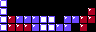

# SVG Tiler

**SVG Tiler** is a tool for drawing diagrams on a grid,
where you draw ASCII art or spreadsheets and SVG Tiler automatically
subsitutes each character or cell with a corresponding SVG symbol
to make a big SVG figure
(in an efficient representation that factors out repeated tiles),
and optionally converts it to PDF, PNG, and/or LaTeX for LaTeX text.
Here are a few examples of generated figures;
see [more examples below](#examples).

| [Super Mario Bros.](examples/mario) | [The Witness](examples/witness) | [Chess](examples/chess) |
| --- | --- | --- |
| [](examples/mario) | [](examples/witness) | [](examples/chess)

## Table of Contents

- [Main Concepts](#main-concepts)
- [Usage](#usage)
- [Mapping Files: .txt, .js, .coffee, .jsx, .cjsx](#mapping-files-txt-js-coffee-jsx-cjsx)
- [Drawing Files: .asc, .ssv, .csv, .tsv, .psv, .xlsx, .xls, .ods](#drawing-files-asc-ssv-csv-tsv-psv-xlsx-xls-ods)
- [Style Files: .css, .styl](#style-files-css-styl)
- [Layout Algorithm](#layout-algorithm)
- [z-index: Stacking Order of Tiles](#z-index-stacking-order-of-tiles)
- [Overflow and Bounding Box](#overflow-and-bounding-box)
- [Autosizing Tiles](#autosizing-tiles)
- [Unrecognized Tiles](#unrecognized-tiles)
- [`<image>` Processing](#image-processing)
- [Converting SVG to PDF/PNG](#converting-svg-to-pdfpng)
- [LaTeX Text](#latex-text)
- [Maketiles](#maketiles)
  - [Maketile.args](#maketileargs)
  - [Maketile.coffee/js](#maketilecoffeejs)
  - [Directories](#directories)
- [API](#api)
- [Examples](#examples)
  - [Video/board games](#videoboard-games)
  - [Demos](#demos)
  - [Research using SVG Tiler](#research-using-svg-tiler)
- [Installation](#installation)
- [Command-Line Usage](#command-line-usage)
- [History](#history)

## Main Concepts

To use SVG Tiler, you combine at least two types of files
(possibly multiple of each type):

1. A **mapping file** specifies how to map tile names (strings) to
   SVG content (either embedded in the same file or in separate files).
   Mapping files can be specified in a simple ASCII format, or
   as a dynamic mapping defined by JavaScript or CoffeeScript code.

2. A **drawing file** specifies a grid of tile names (strings) which,
   combined with one or more mapping files to define the SVG associated
   with each tile, compile to a single (tiled) SVG.
   Drawing files can be specified as
   ASCII art (where each tile name is limited to a single character),
   space-separated ASCII art (where tile names are separated by whitespace),
   standard CSV/TSV (comma/tab-separated) tabular formats, or
   standard multi-sheet spreadsheet formats XLSX/XLS/ODS
   supported by Google Sheets, OfficeOffice, and Excel.

3. An optional **style file** specifies global styling of SVG elements via
   [CSS](https://developer.mozilla.org/en-US/docs/Web/SVG/Tutorial/SVG_and_CSS)
   or [Stylus](https://stylus-lang.com/).

Here's a simple full example from
[Tetris in the pixel-art style of the NES game](examples/tetris):

<table>
<tr>
<th>Input mapping
<br>(.txt format)
<th>Input drawing
<br>(.asc format)
<th>Output
<br>(.png format)
<tr>
<td>

```
T NES_level7_empty.png
O NES_level7_empty.png
I NES_level7_empty.png
J NES_level7_filled.png
S NES_level7_filled.png
L NES_level7_other.png
Z NES_level7_other.png
  <rect fill="black" width="8" height="8"/>
```

PNG image files referenced above:


<td>

```
I           
I          Z
ILJJJOO SSZZ
ILLLJOOSS Z 
```

<td>



</table>

## Usage

Normally, you run `svgtiler` on the command line, listing
all input files (mapping, drawing, and style files) as arguments.
Mapping and style files apply to all drawing files listed later.
File types and formats are distinguished automatically by their extension,
as listed below.
For example:

```
svgtiler map1.txt map2.coffee drawing.asc drawings.xlsx
```

will generate `drawing.svg` using the mappings in `map1.txt` and `map2.coffee`,
and will generate `drawings_<sheet>.svg` for each unhidden sheet in
`drawings.xlsx`.

`svgtiler` automatically skips building when it detects all dependencies
(including the input drawing file, all style files, all mapping files,
and anything `require`d by JavaScript/CoffeeScript mapping files)
are older than the SVG file, similar to `make`.
In these cases, you will see the message `(SKIPPED)` in the output.
In addition, `svgtiler` will avoid writing a `.svg` or `.tex` file
(and changing their timestamp) if the contents haven't changed;
in these cases, you will see the message `(UNCHANGED)` in the output.
In particular, this will prevent these files from getting
[converted to PDF or PNG](#converting-svg-to-pdfpng)
(unless those files are out-of-date).
You can override this behavior via the `-f`/`--force` command-line option,
which forces all building and conversions to take place.

Alternatively, you can use the [SVG Tiler API](#api) to render SVG from your
own JavaScript code, e.g., converting ASCII art embedded within a webpage
into SVG drawings.

## Mapping Files: .txt, .js, .coffee, .jsx, .cjsx

In general, mapping files provide a partial mapping from tile names
(which are generally strings) to SVG content.  Most often, your SVG
content should consist of a `<symbol>` or `<svg>` tag at the top level,
with `width` and `height` attributes (for a coordinate system of
[0, width] &times; [0, height]) or with a `viewBox` attribute
(for a more general coordinate system e.g. starting at negative values).
You can sometimes get away with less;
see [Autosizing Tiles](#autosizing-tiles).

In the **.txt format** for mapping files, each line consists of a tile name
(either having no spaces, or consisting entirely of a single space),
followed by whitespace, followed by either a block of SVG code
(such as `<symbol viewBox="...">...</symbol>`) or a filename containing
such a block.  For example, here is a mapping of `O` to black squares
and both ` ` (space) and empty string to blank squares, all dimensioned
50 &times; 50:

```svg
O <symbol viewBox="0 0 50 50"><rect width="50" height="50"/></symbol>
  <symbol viewBox="0 0 50 50"/>
 <symbol viewBox="0 0 50 50"/>
```

Here is a mapping of the same tiles to external files:

```
O O.svg
  blank.svg
 blank.svg
```

In the **.js / .coffee / .jsx / .cjsx formats**, the file consists of
JavaScript / CoffeeScript code that gets loaded as a NodeJS module.
The code specifies a `mapping` in one of a few ways:

1. `export map = mapping` or `export default mapping`
   (ECMAScript modules style)
2. `exports.map = mapping` or `exports.default = mapping`
   (CommonJS modules style)
3. Writing a top-level object, array, or function expression
   at the end of the file (without e.g. being assigned to a variable),
   which triggers an implicit `export default`.

In any case, `mapping` should be one of the following types of **mapping**
objects:

1. A plain **JavaScript object** whose properties map tile names to tiles
   (e.g., `{O: tile1, ' ': tile2}`).
2. A [**`Map` object**](https://developer.mozilla.org/en-US/docs/Web/JavaScript/Reference/Global_Objects/Map)
   mapping tile names to tiles.
3. A **function** taking two arguments &mdash; a tile name (string)
   and a `Context` object (also passed as `this`) &mdash; and returning a tile.
   This feature allows you to parse tile names how you want, and to
   vary the tile depending on the context (e.g., neighboring tile names
   or parity of the tile location).
4. An `svgtiler.Mapping` object containing one of the listed formats, e.g.,
   `new svgtiler.Mapping((key, context) => ...)`.
   Such an object can also be obtained from a mapping file (as if it were
   specified on the command line) via `svgtiler.require(filename)`.
5. An `svgtiler.Mappings` object containing one or more of the listed formats,
   e.g., `new svgtiler.Mappings(mapping1, mapping2)`.  `Mappings` look up
   the specified key in each mapping in reverse sequential order until
   finding one that doesn't resolve to `null` or `undefined`
   (so later mappings take priority over earlier mappings,
   as on the command line).
6. An `Array` of any of the above types, meaning to run the mappings
   in parallel and stack the resulting tiles on top of each other,
   with the first non-null tile defining the tile size.
   (See next list for more details.)

Each **tile** (property of JavaScript object, value of `Map` object,
or return value of a function) should be specified as one of the following:

1. SVG written directly in
   [JSX](https://reactjs.org/docs/introducing-jsx.html) syntax, such as
   `<symbol viewBox=`0 0 ${width} ${height}`>{parity ? child1 : child2}</symbol>`;
   or its [CoffeeScript analog](https://coffeescript.org/#jsx), such as
   `<symbol viewBox="0 0 #{width} #{height}">{if parity then child1 else child2}</symbol>`.
   (See e.g. [the polyomino example](examples/polyomino).)
2. [Preact](https://preactjs.com/) (React-style) Virtual DOM elements built via
   [`preact.h`](https://preactjs.com/guide/v10/api-reference/#h--createelement)
   calls.  (This is what JSX notation actually gets converted into.)
   Be careful not to modify Preact nodes, in case you re-use them; instead use
   [`preact.cloneElement`](https://preactjs.com/guide/v10/api-reference/#cloneelement)
   to make a modified copy (or before modification).
3. A string of raw SVG code (detected by the presence of a `<` character).
4. A filename with `.svg` extension containing SVG code that gets inlined.
5. A filename with `.png`, `.jpg`, `.jpeg`, or `.gif` extension containing an
   image, which will get [processed](#image-processing) as an `<image>`.
6. An empty string, short for the empty symbol `<symbol viewBox="0 0 0 0"/>`.
7. `undefined` or `null`, indicating that this mapping doesn't define a tile
   for this tile name (and the next mapping should be checked).
8. Another mapping (JavaScript object, `Map` object, function,
   `svgtiler.Mapping`, or `svgtiler.Mappings`) that gets recursively evaluated
   as described above (with the same tile name and context).
   For example, a top-level JavaScript object could map some tile
   names to functions (when they need to be dynamic); or a top-level function
   could return different mappings depending on context.
9. A tile in one of the listed formats wrapped in a call to `svgtiler.static`,
   e.g., `svgtiler.static(<symbol/>)`.  This wrapper tells SVG Tiler that the
   tile mapping is always the same for this tile name, and does not depend on
   `Context` (e.g. adjacent tiles), enabling SVG Tiler to do more caching.
   This is only necessary if you use functions to define tiles; otherwise,
   SVG Tiler will automatically mark the tiles as static.
10. An `Array` of tiles of any of the listed formats (including more `Array`s,
    which get flattened), meaning to stack multiple tiles on top of each other,
    where the first non-null tile defines the `viewBox` and size
    (but all can influence the [`boundingBox`](#overflow-and-bounding-box)).
    Use [`z-index`](#z-index-stacking-order-of-tiles)
    to control stacking order.
    Null items in the array get ignored, and an empty array acts like `null`
    (this mapping does not define a tile for this tile name).
    You can put functions inside arrays (which effectively disappear if they
    return `null`/`undefined`), or return arrays from functions, or both.

If you need to use a `<marker>`, `<filter>`, gradient, or other element
intended for `<defs>`, call `svgtiler.def(tag)`, where `tag`
is one of the above representations of the marker, filter, gradient, etc.
This function adds the object to `<defs>` (if needed) at the top of the SVG,
and returns an object `def` with property `def.id` containing a unique `id`
string, and helper methods `def.url()` and `def.hash()` generating `url(#id)`
(as you'd use markers or gradients) and `#id` (as you'd use in `<use>`)
respectively.
By default, the `id` starts with `marker`, `filter`, etc.
according to the top-level tag of `tag`.
You can choose a better name by giving the tag an initial `id`, e.g.,
`svgtiler.def(<marker id="arrow">...</marker>)`.
You can call `svgtiler.def` within a tile function (where repeated calls
with the same argument produce the same def and `id`) or at the global level
of your mapping file (for static defs).
See [the grid-graph example](examples/grid-graph) for an example with markers.

Similarly, if you need to assign an `id` within your tile definition
(e.g., to render and then re-use an object multiple times), define the tile
with a function, and have that function call `svgtiler.id(baseId)`
to generate and return a unique `id` string starting with `baseId`
(which defaults to `"id"`).

Functions get called with a **`Context`** object as both a second argument and
as `this` (if the function is defined via `function`;
[`=>` functions](https://developer.mozilla.org/en-US/docs/Web/JavaScript/Reference/Functions/Arrow_functions)
can't have `this` bound).
Instead of passing the `Context` object to other functions, they can access
the currently active `Context` via `svgtiler.getContext()`.
The `Context` object has the following properties and methods:

* `context.key` is the tile name, or `undefined` if the `Context` is out of
  bounds of the drawing.  (This can't happen in the initial call,
  but can happen when you call `context.neighbor`.)
* `context.includes(substring)` computes whether `context.key` contains the
  given `substring` (a shortcut for `context.key.includes(substring)` in
  ECMAScript 2015, but handling the case when `context.key` is `undefined`).
* `context.startsWith(substring)` and `context.endsWith(substring)` are
  similar shortcuts, but failing when `context.key` is `undefined`.
* `context.match(regex)` matches `context.key` against the given regular
  expression (a shortcut for `context.key.match(regex)`,
  but handling the case when `context.key` is `undefined`).
* `context.i` is the row number of the cell of this tile (starting at 0).
* `context.j` is the column number of the cell of this tile (starting at 0).
* `context.neighbor(dj, di)` returns a new `Context` for row `context.i + di`
  and column `context.j + dj` (for relative neighbors).
  (Note the reversal of coordinates, so that the order passed to `neighbor`
  corresponds to *x* then *y* coordinate.)
  If there is no tile at that position, you will still get a `Context` object
  but its `key` value will be `undefined` and `includes()` and `match()`
  will always return `false`.
* `context.at(j, i)` returns a new `Context` for row `j` and column `i`
  (absolute coordinates).
  (Note again the reversal of coordinates to correspond to *x* before *y*.)
  Negative numbers count backward from the last row or column.
* In particular, it's useful to call e.g.
  `context.neighbor(1, 0).includes('-')` to check for adjacent tiles that
  change how this tile should be rendered.
* `context.row(di = 0)` returns an array of `Context` objects, one for each
  tile in row `i + di` (in particular, including `context` if `di` is the
  default of `0`).  For example, you can use the
  [`some`](https://developer.mozilla.org/en-US/docs/Web/JavaScript/Reference/Global_Objects/Array/some)
  or
  [`every`](https://developer.mozilla.org/en-US/docs/Web/JavaScript/Reference/Global_Objects/Array/every)
  method on this array to do bulk tests on the row.
* `context.column(dj = 0)` returns an array of `Context` objects, one for each
  tile in column `j + dj`.
* `context.set(key)` changes the key at the context's position to the
  specified value.  This can be useful for changing keys that haven't been
  processed yet (later in reading order) to affect later processing.
* `context.filename` is the name of the drawing file (e.g. `"input.xlsx"`).
* `context.subname` is the name of the sheet within the spreadsheet drawing input,
  or `undefined` if the drawing input format does allow multiple sheets.
* `context.drawing` is an instance of `Drawing` (see below).
* You can also add extra data to the main `context` object given to the
  function, and it will be shared among all calls to all mapping/tile
  functions within the same drawing (but not between separate drawings).
  This can be useful for drawing-specific state.

The top-level code of your .js or .coffee mapping file can also export
the following functions:

* `export init` to schedule calling `init(mapping)` whenever
  this mapping file is listed on the command line
  (including right after the mapping file is first loaded), and
  when state gets reset (e.g. via a `)` command-line argument).
  Note that each mapping file gets loaded (`require`d)
  as a NodeJS module, which happens only once, so if your file uses any
  side effects (in particular, reading or writing to the `share` object
  for communication with other mapping files), it's important to put that code
  in an `init` function instead of at the top level, so that SVG Tiler
  can correctly limit and restore these side effects in the presence of
  parentheses on the command line or when running multiple build rules.
* `export preprocess` to schedule calling `preprocess(render)`
  when preparing to rendering each drawing, e.g.,
  to initialize drawing-specific data or globally examine the drawing.
  The `render` argument (and `this`) is set to a [`Render`](#render-class)
  instance,
  which in particular has `drawing`, `mappings`, and `styles` attributes.
  You can even modify the drawing's `keys` at this stage,
  by modifying `render.drawing.keys`.
  Alternatively, loop over the cells using `render.forEach((context) => ...)`
  and use `context.set(newKey)`.
  You can also add SVG content via `render.add` or `svgtiler.add`,
  e.g., add metadata like `svgtiler.add(<title>My drawing</title>)`;
  or set a default background color via `render.background(color)` or
  `svgtiler.background(color)`.
* `export postprocess` to schedule calling `postprocess(render)`
  after rendering each drawing, e.g., to modify or add to the drawing.
  During the callback, `render` has properties about the rendering's
  bounding box: `xMin`, `xMax`, `yMin`, `yMax`, `width`, `height`.
  You can add SVG content (overlay/underlay) via `render.add` or
  `svgtiler.add`, which you can pass a string or Preact Virtual DOM.
  Specify a [`z-index`](#z-index-stacking-order-of-tiles)
  to control the stacking order relative to other symbols
  or overlays/underlays.
  Specify [`boundingBox`](#overflow-and-bounding-box) to increase the
  overall size of the rendered drawing.
  You can also set the final background color via
  `render.background(color)` or `svgtiler.background(color)`.
  When used only once, this is equivalent to the postprocess step of
  `render.add(<rect z-index="-Infinity" fill={fillColor} x={render.xMin} y={render.yMin} width={render.width} height={render.height}/>)`.

You can call `svgtiler.background(color)` in `preprocess`, `postprocess`,
or tile definition functions.  Only the final color will end up being
rendered, as a single background `<rect>` beneath the whole drawing's
bounding box.  You can also set a global default background color via the
`--bg`/`--background` command-line option.

`Drawing` objects (available via `context.drawing` in mapping functions
or `render.drawing` in `preprocess` and `postprocess` callbacks) have
the following useful attributes:

* `drawing.filename` is the name of the drawing file (e.g. `"input.xlsx"`).
* `drawing.subname` is the name of the sheet within the spreadsheet drawing
  input, or `undefined` if the drawing input format does allow multiple sheets.
* `drawing.keys` is an array of array of keys, with one array per row.
* `drawing.get(j, i)` gets the key at row `i`, column `j`
  (note reversed order), without any special processing.
* `drawing.at(j, i)` gets the key at row `i`, column `j`
  (note reversed order), with negative numbers counting back from the end.
* `drawing.set(j, i, key)` sets the key at row `i`, column `j`
  (note reversed order, without any special processing) to `key`,
  adding rows or columns as necessary.
* `drawing.margins` is an object specifying the `left`, `right`,
  `top`, and `bottom` margins automatically removed, unless you use
  `--margin` command-line option.  This lets you adjust global parity
  according to the margins, for example.
* `drawing.unevenLengths` is an array of original row lengths
  before rows were made to be the same length, unless you use the
  `--uneven` command-line option.
  Note that these lengths do not include margins (which get removed first).

Like other [NodeJS modules](https://nodejs.org/api/modules.html),
.js and .coffee files can access `__dirname` and `__filename`,
e.g., to use paths relative to the mapping file.
In addition to the preloaded module `preact`,
they have access to the SVG Tiler API via `svgtiler`, and
a global shared object `share` that you can add properties to
for communication between mapping files
(e.g., for one mapping file to provide settings to another mapping file).
You can also use the command-line option `-s`/`--share` to set properties
of `share`, as in [the Mario example](examples/mario):
`-s KEY=VALUE` sets `share.KEY` to `"VALUE"`, while
`-s KEY` sets `share.KEY` to `undefined`.

You can also use `import ... from './filename'` or `require('./filename')`
to import local modules or files relative to the mapping file.

* In particular, you can share .js/.coffee code or .json config files
  among mapping files.
* If you `import`/`require` a filename with `.svg` extension, you obtain a
  Preact Virtual DOM object `svg` representing the SVG file, which you can
  include in a JSX template via `{svg}`.
  You can also easily manipulate the SVG before inclusion.
  For example, `svg.props.children` strips off the outermost tag,
  allowing you to rewrap as in `<symbol>{svg.props.children}</symbol>`;
  see [the Chess example](examples/chess).
  Or [`preact.cloneElement`](https://preactjs.com/guide/v10/api-reference/#cloneelement)
  lets you override certain attributes or add children; for example,
  `preact.cloneElement(svg, {class: 'foo'}, <rect width="5" height="5"/>, svg.props.children)`
  adds a `class` attribute and prepends a `<rect>` child.
  Alternatively, use `svg.svg` (the `svg` attribute of the returned object)
  to get the SVG string (with comments removed).
  Note that the `.svg` file can even have JSX notation in it, such as
  `<svg width={share.width} height={share.height}>`, but `svg.svg` will not
  interpret it specially.
* If you `import`/`require` a filename with `.png`, `.jpg`, `.jpeg`, or `.gif`
  extension, you obtain a Preact Virtual DOM object `image`
  representing an `<image>` tag for the file's inclusion,
  which you can include in a JSX template via `{image}`.
  Or if you want to inline/manipulate the SVG string, use `image.svg`.

## Drawing Files: .asc, .ssv, .csv, .tsv, .psv, .xlsx, .xls, .ods

The **.asc format** for drawing files represents traditional ASCII art:
each non-newline character represents a one-character tile name.
For example, here is a simple 5 &times; 5 ASCII drawing using tiles
`O` and ` `&nbsp;(space):

```
 OOO
O O O
OOOOO
O   O
 OOO
```

.asc files can include Unicode characters encoded in UTF8.
In this case, a single "character" is defined as a full "Unicode grapheme"
(according to [UAX #29](https://unicode.org/reports/tr29/#Grapheme_Cluster_Boundary_Rules), via the [grapheme-splitter library](https://github.com/orling/grapheme-splitter)),
such as 👍🏽.
See [an example with Unicode](examples/unicode).

The **.ssv, .csv, .tsv, and .psv formats** use
[delimiter-separated values (DSV)](https://en.wikipedia.org/wiki/Delimiter-separated_values)
to specify an array of tile names.  In particular,
[.csv (comma-separated)](https://en.wikipedia.org/wiki/Comma-separated_values)
and
[.tsv (tab-separated)](https://en.wikipedia.org/wiki/Tab-separated_values)
formats are exactly those exported by spreadsheet software such as
Google Drive, OpenOffice, or Excel, enabling you to draw in that software.
The .psv format uses the pipe character `|` as the delimiter,
similar to Markdown tables.
The .ssv format is similar, but where the delimiter between tile names
is arbitrary whitespace.
(Contrast this behavior with .csv which treats every comma as a delimiter.)
This format is nice to work with in a text editor, allowing you to line up
the columns by padding tile names with extra spaces.
All four formats support quoting according to the usual DSV rules:
any tile name (in particular, if it has a delimiter or double quote in it)
can be put in double quotes, and double quotes can be produced in the
tile name by putting `""` (two double quotes) within the quoted string.
Thus, the one-character tile name `"` would be represented by `""""`.

The **.xlsx, .xlsm, .xlsb, .xls** (Microsoft Excel),
**.ods, .fods** (OpenDocument), **.dif** (Data Interchange Format),
**.prn** (Lotus), and **.dbf** (dBASE/FoxPro) formats support data straight
from spreadsheet software.  This format is special in that it supports
multiple sheets in one file.  In this case, the output SVG files have
filenames distinguished by an underscore followed by the sheet name.
By default, **hidden** sheets are ignored, making it easy to "deprecate" old
drafts, but if you prefer, you can process hidden sheets via `--hidden`.
Currently, hidden sheet detection only works in .xls* files; see
File Format Support for
[SheetJS Sheet Visibility](https://docs.sheetjs.com/docs/csf/features/visibility/).

## Style Files: .css, .styl

Any input file in **.css format** gets inlined into an
[SVG `<style>` tag](https://developer.mozilla.org/en-US/docs/Web/SVG/Element/style).
[Mixing SVG and CSS](https://developer.mozilla.org/en-US/docs/Web/SVG/Tutorial/SVG_and_CSS)
lets you define global style rules for your SVG elements, for example,
specifying `fill` and `stroke` for every `polygon` of class `purple`:

```css
polygon.purple { fill: hsl(276, 77%, 80%); stroke: hsl(276, 89%, 27%) }
```

Instead of raw CSS, you can use the **.styl format** to write your styles
in the indentation-based format [Stylus](https://stylus-lang.com/).
The example above could be written as follows in .styl:

```stylus
polygon.purple
  fill: hsl(276, 77%, 80%)
  stroke: hsl(276, 89%, 27%)
```

See the [animation example](examples/anim) for sample usage of a .css or
.styl file.

If you'd rather generate a `<style>` tag dynamically depending on the
drawing content, you can do so in a .js or .coffee mapping file by calling
`svgtiler.add` during a `preprocess` or `postprocess` export.

## Layout Algorithm

Given one or more mapping files and a drawing file, SVG Tiler follows a fairly
simple layout algorithm to place the SVG expansions of the tiles into a
single SVG output.  Each tile has a bounding box, either specified by
the `viewBox` of the root `<symbol>` or `<svg>` element, or
[automatically computed](#automatic-symbol-wrapping).
The algorithm places tiles in a single row to align their top edges,
with no horizontal space between them.
The algorithm places rows to align their left edges so that the rows' bounding
boxes touch, with the bottom of one row's bounding box equalling the top of
the next row's bounding box.

This layout algorithm works well if each row has a uniform height and each
column has a uniform width, even if different rows have different heights
and different columns have different widths.  But it probably isn't what you
want if tiles have wildly differing widths or heights, so you should set
your `viewBox`es accordingly.

Each unique tile gets defined just once (via SVG's
[`<symbol>`](https://developer.mozilla.org/en-US/docs/Web/SVG/Element/symbol))
and then instantiated (via SVG's
[`<use>`](https://developer.mozilla.org/en-US/docs/Web/SVG/Element/use))
many times, resulting in relatively small and efficient SVG outputs.

## z-index: Stacking Order of Tiles

Often it is helpful to render some tiles on top of others.
Although [SVG](https://www.w3.org/TR/SVG2/) does not support a `z-index`
property, there was
[a proposal](https://www.w3.org/TR/2016/CR-SVG2-20160915/render.html#ZIndexProperty)
which SVG Tiler supports *at the `<symbol>` level*, emulated by
re-ordering tile rendering order to simulate the specified z order.
For example, the tile `<symbol viewBox="0 0 10 10" z-index="2">...</symbol>`
will be rendered on top of (later than) all tiles without a
`z-index="..."` specification (which default to a z-index of 0).
You can use a `z-index="..."` property or an HTML-style
`style="z-index: ..."` property.
The special values `Infinity`, `+Infinity`, and `-Infinity` are allowed
(along with variants like `Inf` or `\infty`).

## Overflow and Bounding Box

By default, SVG Tiler (v1.15+) sets all tile `<symbol>`s to have
[`overflow="visible"`](https://developer.mozilla.org/en-US/docs/Web/SVG/Attribute/overflow)
behavior, meaning that they can draw outside their `viewBox`.
If you want to override this behavior and clip symbols to their `viewBox`,
you have two options.  At the `<symbol>` level, use `overflow="hidden"` or
`style="overflow: hidden"`.  At the global level, use the `--no-overflow`
command-line option (and use `overflow="visible"` to make some symbols
overflow).

When `overflow` is `visible`, `viewBox` still represents the size of the
element in the [grid layout](#layout-algorithm),
but allows the element's actual bounding box to be something else.
To correctly set the bounding box of the overall SVG drawing, SVG Tiler
defines an additional `<symbol>` attribute called `boundingBox`, which is like
`viewBox` but for specifying the actual bounding box of the content
(when they differ &mdash; `boundingBox` defaults to the value of `viewBox`).
The `viewBox` of the overall SVG is set to the minimum rectangle
containing all tiles' `boundingBox`s.

For example,
`<symbol viewBox="0 0 10 10" boundingBox="-5 -5 20 20">...</symbol>`
defines a tile that gets laid out as if it occupies the [0, 10] &times;
[0, 10] square, but the tile can draw outside that square, and the overall
drawing bounding box will be set as if the tile occupies the
[&minus;5, 15] &times; [&minus;5, 15] square.

The `boundingBox` can also be *smaller* than the `viewBox`, in case the
`viewBox` needs to be larger for proper grid alignment but the particular
symbol doesn't actually use the whole space.
For example, `<symbol viewBox="0 0 10 10" boundingBox="5 5 10 10"/>`
allocates 10×10 of space but may shrink down to 10×5 when used on the
top edge of the diagram (if no other symbols' bounding box extend above)
or 5×10 when used on the left edge of the diagram,
or 5×5 in the top-left corner.
You can also use the special value `boundingBox="none"` to specify that
the symbol should not influence the drawing's `viewBox` at all,
or `boundingBox="null -5 null 10"` to just affect the vertical extent (say).

Even zero-width and zero-height `<symbol>`s will get rendered (unless
`overflow="hidden"`).  This can be useful for drawing grid
outlines without affecting the overall grid layout, for example.
(SVG defines that [symbols are invisible if they have zero width or
height](https://developer.mozilla.org/en-US/docs/Web/SVG/Attribute/viewBox),
so SVG Tiler automatically works around this by using slightly positive
widths and heights in the output `viewBox`.)

The `boundingBox` attribute used to be called `overflowBox` (prior to v3).
For backward compatibility, the old name is still supported, but in either
case it can cause both overflow and underflow relative to `viewBox`.

## Autosizing Tiles

Normally, a tile specifies its layout size by setting the
`width` and `height` attributes or by setting the `viewBox` attribute
of an outermost `<symbol>` or `<svg>` tag.
But there is actually a long sequence of ways that SVG Tiler tries to
figure out the width and height of the tile:

1. If the tile's top-level tag is `<symbol>` or `<svg>`, then
   `width` and `height` attributes of that tag take priority.
   Normally these are specified in SVG units (`px`),
   but you can also use
   [CSS units](https://www.w3.org/TR/css-values-3/#absolute-lengths)
   that get translated to `px`.
2. The `--tw`/`--tile-width` and `--th`/`--tile-height` command-line options
   define the default width and height for all tiles that don't have an
   explicit `width` and `height`, including if you didn't use an outermost
   tag of `<symbol>` or `<svg>`.
3. [`viewBox`](https://developer.mozilla.org/en-US/docs/Web/SVG/Attribute/viewBox)
   is considered next, and serves as an alternative to `width` and
   `height` if you want your coordinate system to start somewhere other than
   (0, 0) (as you get from the methods above).
   If a tile's outermost tag is `<symbol>` or `<svg>`
   with a `viewBox` attribute, then the width and height of that attribute
   (the third and fourth numbers) are treated as the tile's width and height.
4. If none of the above are found, then SVG Tiler attempts to set the
   `viewBox` to the bounding box of the SVG elements in the symbol.
   For example, the SVG `<rect x="-5" y="-5" width="10" height="10"/>`
   will automatically get wrapped by
   `<symbol viewBox="-5 -5 10 10">...</symbol>`.
   However, the current computation has many limitations (see the code for
   details), so it is recommended to specify your own `width`/`height` or
   `viewBox` in your own `<symbol>` or `<svg>` wrapping element,
   especially to control the layout bounding box
   which may different from the contents' bounding box.

As a special non-SVG feature, a tile `<symbol>` can specify `width="auto"`
and/or `height="auto"` to make their instantiated width and/or height
match their column and/or row, respectively.
In this way, multiple uses of the same symbol can appear as different sizes.
See the [auto-sizing example](examples/auto).

If you want to nonuniformly scale the tile, you may want to also adjust
the `<symbol>`'s [`preserveAspectRatio`](https://developer.mozilla.org/en-US/docs/Web/SVG/Attribute/preserveAspectRatio) property.

## Unrecognized Tiles

Any undefined tile displays as a red-on-yellow diamond with a question mark
(like the [Unicode replacement character �](https://en.wikipedia.org/wiki/Specials_(Unicode_block)#Replacement_character)),
with automatic width and height, so that it is easy to spot.
SVG Tiler also lists any unrecognized tiles at the end of its output.

If evaluating a tile raises an exception (usually from code in your
.js/.coffee mapping files), the tile renders as a red-on-yellow triangle
with an exclamation mark (like the Unicode warning sign ⚠️).
SVG Tiler also Tiler outputs the error and stack trace, and
lists any erroring tiles at the end of its output.

See the [auto sizing example](examples/auto).

## `<image>` Processing

`<image>` tags in SVG (or image filenames specified by a mapping file, which
automatically get wrapped by an `<image>` tag) get some special additional
processing:

1. The default
   [`image-rendering`](https://developer.mozilla.org/en-US/docs/Web/CSS/image-rendering)
   is the equivalent of `pixelated`, for pixel art.
   You can also explicitly specify `image-rendering="pixelated"`
   or `image-rendering="optimizeSpeed"`.
   Either way, this behavior gets achieved by a combination of
   `image-rendering="optimizeSpeed"` (for Inkscape) and
   `style="image-rendering:pixelated"` (for Chrome).

   If you would rather have smoothed images, set `image-rendering="auto"`.

2. An omitted `width` and/or `height` automatically get filled in according to
   the image size (scaled if exactly one of `width` and `height` is specified).

3. The image file contents will get inlined into the SVG document (in base64),
   which makes the `.svg` file a stand-alone document.
   If you specify the `--no-inline` command-line option, the `.svg` file will
   load externally linked images only if you have the auxiliary image files
   with the correct paths.

4. Duplicate inlined images (with the same contents and `image-rendering`, but
   not necessarily the same `x`/`y`/`width`/`height`) will get shared via a
   common SVG `<symbol>`.  This makes for efficient SVG files when multiple
   keys map to the same symbol, or when multiple symbols use the same
   component image.

## Converting SVG to PDF/PNG

SVG Tiler can automatically convert all exported SVG files (and any
`.svg` files specified directly on the command line) into PDF and/or PNG,
if you have [Inkscape](https://inkscape.org/) v1+ installed,
via the `-p`/`--pdf` and/or `-P` or `--png` command-line options.
For example: `svgtiler -p map.coffee drawings.xls`
will generate both `drawings_sheet.svg` and `drawings_sheet.pdf`.
PNG conversion is intended for pixel art; see the
[Tetris example](examples/tetris/).

SVG Tiler uses [svgink](https://github.com/edemaine/svgink) as an efficient
interface to Inkscape's conversion from SVG to PDF or PNG.
If you just want to convert SVG files, consider using svgink directly.
If you want to do a mix of SVG tiling and SVG export with a shared pool of
Inkscape processes, you can run `svgtiler` with a mix of drawings and raw
`.svg` files that you want to convert.
Any `.svg` files on the command line are passed through to svgink.

svgink has some
[command-line options](https://github.com/edemaine/svgink#command-line-interface)
that SVG Tiler also accepts:

* svgink [automatically runs](https://github.com/edemaine/svgink#efficiency)
  multiple Inkscape processes to exploit multicore CPUs.
  You can change the number of Inkscape processes to run
  via the `-j`/`--jobs` command-line option.
  For example, `svgtiler -j 4 -p map.coffee drawings.xls`
  will run up to four Inkscape jobs at once.
* svgink automatically detects whether the PDF/PNG files are newer than
  the input SVG files, in which case it skips conversion.
  You can override this behavior via the `-f`/`--force` command-line option.
* You can change where to put converted files via the
  `--op`/`--output-pdf` and `--oP`/`--output-png` command-line options.
  In addition, SVG Tiler supports `--os`/`--output-svg` to control where
  to put generated SVG files, and `-o`/`--output` to control the default
  place to put all generated/converted files.
* You can override the generated/converted filenames for the next drawing
  using the `-O`/`--output-stem` command-line option.
  You can also specify a stem pattern like `-O prefix_*_suffix`,
  where `*` represents the input stem,
  in which case the override applies until the next `-O` option.
  (In particular, `-O *` restores the initial behavior.)
* If Inkscape isn't on your PATH, you can specify its location via
  `-i`/`--inkscape`.

## LaTeX Text

Using the `-t` command-line option, you can extract all `<text>` from the SVG
into a LaTeX overlay file so that your text gets rendered by LaTeX during
inclusion.

For example: `svgtiler -p -t map.coffee drawings.xls`
will create `drawings_sheet.svg`, `drawings_sheet.pdf`, and
`drawings_sheet.svg_tex`.  The first two files omit the text, while the third
file is the one to include in LaTeX, via `\input{drawings_sheet.svg_tex}`.
The same `.svg_tex` file will include graphics defined by `.pdf`
(created with `-p`) or `.png` (created with `-P`).

You can control the scale of the graphics component by defining
`\svgwidth`, `\svgheight`, or `\svgscale` before `\input`ting the `.svg_tex`.
(If more than one is specified, the first in the list takes priority.)
For example:
* `\def\svgwidth{\linewidth}` causes the figure to span the full width
* `\def\svgheight{5in}` makes the figure 5 inches tall
* `\def\svgscale{0.5}` makes the figure 50% of its natural size
  (where the SVG coordinates' unit translates to 1px = 0.75bp)

If the figure files are in a different directory from your root `.tex` file,
you need to help the `.svg_tex` file find its auxiliary `.pdf`/`.png` file
via one of the following options (any one will do):
* `\usepackage{currfile}` to enable finding the figure's directory.
* `\usepackage{import}` and `\import{path/to/file/}{filename.svg_tex}`
  instead of `\import{filename.svg_tex}`.
* `\graphicspath{{path/to/file/}}` (note extra braces and trailing slash).

SVG Tiler will attempt to align `<text>` elements according to their
[`text-anchor`](https://developer.mozilla.org/en-US/docs/Web/SVG/Attribute/text-anchor)
and
[`alignment-baseline`](https://developer.mozilla.org/en-US/docs/Web/SVG/Attribute/alignment-baseline)
properties.
It will not respect font specification; instead, include LaTeX commands
(e.g. `\footnotesize` or `\sf`) in your text.

## Maketiles

SVG Tiler has a simple `Makefile`-like build system for keeping track of the
`svgtiler` command-line arguments needed to build your tiled figures.
These `Maketile`s generally get run whenever you run `svgtiler` without
any filename arguments (including directories or glob patterns), for example,
when just running `svgtiler` without any arguments,
or when providing just flags like `svgtiler -f`.
(If you ever want to skip the `Maketile` behavior, just provide mapping
and drawing filename arguments like you normally would.)
Several examples of `Maketile`s are in the [examples](examples) directory.

### Maketile.args

At the simplest level, you can put the command-line arguments to `svgtiler`
into a file called `Maketile.args` (or `maketile.args`), and then running
`svgtiler` without any filename arguments will automatically
append those arguments to the command line.
Thus the `.args` file could specify the
mappings and drawings to render, and you can still add extra options like
`--pdf` or `--force` to the actual command line as needed.
The `.args` file gets parsed similar to the `bash` shell,
so you can write one-line comments with `#`,
you can use
[glob expressions](https://github.com/isaacs/node-glob#glob-primer)
like `**/*.asc`,
and you put quotes around filenames with spaces or other special characters.
You can also write the arguments over multiple lines
(with no need to end lines with `\`).

### Maketile.coffee/.js

The more sophisticated system is to write a `Maketile.coffee` or
`Maketile.js` file.  This system offers the entire CoffeeScript or
JavaScript programming language to express complex build rules.
The file can provide build rules in one of a few ways:

1. `export make = ...` (ESM) or `exports.make = ...` (CommonJS)
2. `export default ...` (ESM) or `exports.default = ...` (CommonJS)
3. Writing a top-level object, array, or function expression
   at the end of the file (without e.g. being assigned to a variable),
   which triggers an implicit `export default`.

The exported rules can be one of the following types:

1. A **function** taking two arguments &mdash; a rule name (string)
   and a `Mapping` object representing the Maketile (also passed as `this`).
   The function should directly run build steps by calling `svgtiler()`;
   see below.  The function's return value is mostly ignored, except that
   a return value of `null` is interpreted as "no rule with that name".
   If the function takes no arguments, it is treated as just defining
   the default build rule `""` (empty string).
2. A plain **JavaScript object** whose properties rule names to rules
   (e.g., `{foo: rule1, bar: rule2, '': defaultRule}`).
3. A [**`Map` object**](https://developer.mozilla.org/en-US/docs/Web/JavaScript/Reference/Global_Objects/Map)
   mapping rule names to rules.
4. An `Array` of any of the above types, meaning to run the rules in sequence.

If you run `svgtiler` with no filename arguments,
the default rule name of `""` (empty string) gets run.
If you run `svgtiler` with one or more arguments that are valid rule names
(containing no `.`s or glob magic patterns like `*` or `?`),
then instead these rules get run in sequence.
(Note that directory names, filenames with extensions, and glob patterns
take priority over Maketile rule names.  So avoid naming rule names that match
directory names; other conflicts are prevented by forbidding `.`/`*`/`?`/etc.
in rule names.)

Rule functions can run the equivalent of an `svgtiler` command line by calling
the `svgtiler` function, e.g., `svgtiler('mapping.coffee *.asc')`.
String arguments are parsed just like `.args` files: whitespace separates
arguments, `#` indicates comments, glob patterns get expanded, and quotes
get processed.
Array arguments are treated as already parsed argument lists, so
the previous example is equivalent to `svgtiler(['mapping.coffee', '*.asc'])`
(where the glob pattern still gets processed, but whitespace in filenames
would not).
Instead of strings, you can also directly pass in `Mapping` or `Drawing` or
`Style` objects (as arguments or as part of an array argument).
An easy way to create such objects is to call `svgtiler.require()`,
which loads any given filename as if it was given on the command line
(without any processing of its filename).
For example, `svgtiler.require('filename with spaces and *s.asc')` transforms
an ASCII file into a `Drawing` object.

There are also tools for manually working with glob patterns:
`svgtiler.glob(pattern)` returns an array of filenames that match a pattern,
and `svgtiler.match(filename, pattern)` checks whether a filename
matches a pattern.
These helpers use [node-glob](https://github.com/isaacs/node-glob) and
[minimatch](https://github.com/isaacs/minimatch) respectively, so follow their
[glob notation](https://github.com/isaacs/node-glob#glob-primer).
Thus you can write your own `for` loops and e.g.
`switch` depending on what additional pattern(s) the filenames match.
For example, `svgtiler('mapping.coffee *.asc')` can be rewritten as
`svgtiler.glob('*.asc').forEach((asc) =>
svgtiler(['mapping.coffee', asc])` or
`svgtiler.glob('*.asc').forEach((asc) =>
svgtiler('mapping.coffee', svgtiler.require(asc))`.

No calls to `svgtiler()` or other side effects should be at the top level
of the `Maketile`.  Instead, put these build steps inside a rule function.

### Directories

It usually makes sense to put `Maketile`s in the directory where your
figures are getting built, but sometimes that's not the directory you're
working in.  For example, SVG Tiler figures may be in a `figures`
subdirectory or your paper's main directory.  In this case, you can trigger
the `Maketile` within the `figures` directory by running `svgtiler figures`.
You can use this shorthand also when defining `Maketile`s,
to recurse into subdirectories.
For example, [examples/Maketile.coffee](examples/Maketile.coffee)
loops over all the subdirectories within `examples` and runs their `Maketile`s.
You can thus trigger building all examples in this repository by typing
`svgtiler examples` at the root directory of a checkout.

## API

SVG Tiler provides an API for rendering SVG directly from your JavaScript code.
On NodeJS, you can `npm install svgtiler` and `require('svgtiler')`.
On a web browser, you can include a `<script>` tag that points to
`lib/svgtiler.js`, and the interface is available via `window.svgtiler`,
though not all features are available or fully functional in this mode.
While the full API is still in flux and the best comments are in
[svgtiler.coffee](src/svgtiler.coffee), here is a subset:

* `new svgtiler.Mapping({map, init, preprocess, postprocess})`:
  Create a mapping the same as a file `export`ing
  `map`/`init`/`preprocess`/`postprocess` (all of which are optional).
  In particular, `map` can be an object, `Map`, or
  function mapping keys to SVG content, just like
  [a JavaScript mapping file](#mapping-files-txt-js-coffee-jsx-cjsx).
* `new svgtiler.Drawing(keys)`: Create a
  [drawing](#drawing-class) with the specified `keys`,
  which is an `Array` of `Array` of `String`s (or other objects),
  where `keys[i][j]` represents the key in the cell at row `i` and column `j`.
* `new svgtiler.Style(css)`: Create CSS styling with the specified `css`
  content (a `String`).  Or use `new svgtiler.StylusStyle(styl)` to parse the 
  string as Stylus.
* `new svgtiler.Render(drawing, [settings])`: Create a
  [rendering job](#render-class) for converting the specified `drawing` to SVG.
  * Put your mappings in `settings.mappings`, which can be a `Mapping` object,
    a valid argument to `new Mapping`, an `Array` of the above, or
    a `Mappings` object (a special type of `Array`).
  * Put additional CSS styling in `settings.styles`, which can be a `Style`
    object, a valid argument to `new Style`, an `Array` of the above, or
    a `Styles` object (a special type of `Array`).
* `svgtiler.require(filename, [settings], [dirname])` loads the specified file
  as if it was on the `svgtiler` command line, producing a
  `Mapping`, `Drawing`, `Drawings`, `Style`, `Args`, or `SVGFile`
  according to the extension.
  The filename is relative to `dirname`, which should (via a Babel plugin)
  default to the script calling `svgtiler.require`.
  For example, `svgtiler.require('./map.coffee')` is equivalent to
  `new Mapping(require('./map.coffee'))`.
  [Node only]
* `svgtiler.renderDOM(elts, settings)`: Convert drawings embedded in the DOM
  via elements matching `elts` (which can be a query selector string like
  `'.svgtiler'`, or a DOM element, or an iterable of DOM elements).
  [Web only]
  * Put your mappings in `settings.mappings`, which can be a `Mapping` object,
    a valid argument to `new Mapping`, an `Array` of the above, or
    a `Mappings` object (a special type of `Array`).
  * Put additional CSS styling in `settings.styles`, which can be a `Style`
    object, a valid argument to `new Style`, an `Array` of the above, or
    a `Styles` object (a special type of `Array`).
  * Each drawing can have a `data-filename` attribute to define its name and
    extension, which determines its format; or you can set `settings` to an
    object specifying a default `filename`.
    The default filename is `"drawing.asc"`, which implies ASCII art.
  * By default, the rendered SVG replaces the original drawing element, but
    the element can specify `data-keep-parent="true"` (or `settings` can specify
    `keepParent: true`) to make it a sole child element instead; or the element
    can specify `data-keep-class="true"` (or `settings` can specify
    `keepClass: true`) for the rendered SVG to keep the same `class` attribute
    as the drawing element.
* `svgtiler.getRender()`: Returns the current `Render` object for the current
  rendering job, which in particular has `drawing`, `mappings`, and `styles`
  attributes.
* `svgtiler.getContext()`: Returns the current `Context` object for the
  currently rendering tile.
* `svgtiler.version`: SVG Tiler version number as a string,
  or `'(web)'` in the browser.
* `svgtiler.needVersion(constraints)`: Require a specified
  [range of version numbers](https://github.com/npm/node-semver#ranges)
  (or throw an error), e.g. `svgtiler.needVersion('3.x')` or
  `svgtiler.needVersion('>=3.0 <3.1')`.
  Put this in your `Maketile.js` or `Maketile.coffee`.

### Drawing Class

An `svgtiler.Drawing` object represents a drawing as a table of keys.
Typically, each key is a string, although this is not required.
(For example, `preprocess` steps might want to convert strings
into other objects.)

A `Drawing` object has the following properties:

* `keys`: `Array` of `Array` of keys (`String`s or other objects),
  where `keys[i][j]` represents the key in the cell at row `i` and column `j`.

A `Drawing` object has the following methods:

* `get(j, i)`: Get the key in the cell in row `i` and column `j`.
  Note that the order is flipped, to correspond to `x`/`y` order.
  Returns `undefined` if out of bounds (or the key is `undefined`).
* `at(j, i)`: Like `get`, but treat negative numbers as relative to the
  bottom/right edge of the drawing, similar to
  [`Array.prototype.at`](https://developer.mozilla.org/en-US/docs/Web/JavaScript/Reference/Global_Objects/Array/at).
  For example, `at(-1, -1)` accesses the bottom-right cell.
* `set(j, i, key)`: Set the `key` in the cell in row `i` and column `j`.
* `renderDOM(settings)`: Render drawing to SVG DOM (native in browser,
  [xmldom](https://github.com/xmldom/xmldom) in Node).
  Append the returned DOM to the document to render it.
  Shorthand for `new Render(drawing, settings).makeDOM()`.

### Render Class

An `svgtiler.Render` object represents a rendering job: converting a
drawing with mappings and styles into an SVG and possibly other formats.
It is passed as the single argument (and `this`) to any user-defined
`preprocess` and `postprocess` functions exported from mapping files.
You can also get the currently rendering `Render` object
(e.g. during `preprocess` or `postprocess` stages) via `svgtiler.getRender()`.

A `Render` object has the following properties:

* `drawing`: `Drawing` object of what's being rendered.
* `mappings`: `Mappings` object containing all the applicable `Mapping`s.
* `styles`: `Style` object containing all the included `Style`s.
* `xMin`, `xMax`, `yMin`, `yMax`: Current bounding box of rendered content.

A `Render` object has the following methods:

* `forEach(callback)`: Calls `callback(context)` once per cell of the drawing,
  with `context` set to a `Context` object (also passed as `this`)
  including `i` (row number), `j` (column number), and `key` attributes.
  This is a convenient way to iterate through a drawing, while being able
  to use all the context methods like `neighbor` and `set`.
* `context(i, j)`: Create new `Context` object at specified coordinates.
  Equivalent to `new svgtiler.Context(render, i, j)`.
* `add(content)`: Add SVG content to the rendering.
  Equivalent to `svgtiler.add(content)`.
* `id(prefix)`: Generate a unique-to-this-render `id` starting with `prefix`.
  The current algorithm uses `prefix`, then `prefix_v0`, then `prefix_v1`, etc.
  This can be useful for assigning an `id` to some SVG content, and then
  referring to it in the same rendering (e.g. duplicating via `<use>`).
  Normally you'd use `svgtiler.id(prefix)` which is equivalent to
  `currentRender().id(prefix)` within a rendering context, and generates
  globally unique ids outside of a rendering context.
* `def(tag)`: Adds SVG content to `<defs>` in the output
  (except when the tag doesn't need to be wrapped in `<defs>`, such as
  `<marker>`, `<filter>`, `<gradient>`), and assigns it a unique ID.
  Returns an `SVGContent` object `def` with property `def.id` containing a
  unique `id` string, and helper methods `def.url()` and `def.hash()`
  generating `url(#id)` (as you'd use markers or gradients) and `#id`
  (as you'd use in `<use>`) respectively.
  Normally you'd use `svgtiler.def(tag)` which is equivalent to
  `currentRender().def(tag)` within a rendering context, and generates
  globally defs outside of a rendering context.
* `background(color)`: Set the background color for this render.
  (Can later be overwritten during the rendering process.)
* `makeDOM()`: Render drawing to SVG DOM (native in browser,
  [xmldom](https://github.com/xmldom/xmldom) in Node).
  Append the returned DOM to the document to render it.

## Examples

This repository contains several examples to help you learn SVG Tiler
by inspection.  Some examples aim to capture real-world games,
while others are more demonstrations of particular SVG Tiler features.

### Video/board games:
* [Super Mario Bros.](examples/mario)
* [Tetris](examples/tetris)
* [Chess](examples/chess)
* [The Witness](examples/witness)
* [Tilt](examples/tilt)

### Demos:
* [Grid graph Hamiltonicity](examples/grid-graph)
* [Polyomino outline drawing and JSX](examples/polyomino)
* [Auto width/height](examples/auto)
* [Unicode](examples/unicode)
* [Animations](examples/anim)
* [Escaping tests](examples/test)

### Research using SVG Tiler:

The following research papers use SVG Tiler to generate (some of their)
figures.  Open an issue or pull request to add yours!

* &ldquo;[Who witnesses The Witness? Finding witnesses in The Witness is hard and sometimes impossible](https://arxiv.org/abs/1804.10193)&rdquo;
  &mdash; [The Witness examples](examples/witness)
* &ldquo;[Losing at Checkers is Hard](https://erikdemaine.org/papers/Checkers_MOVES2017/)&rdquo;
* &ldquo;[Path Puzzles: Discrete Tomography with a Path Constraint is Hard](https://erikdemaine.org/papers/PathPuzzles_GC/)&rdquo;
* &ldquo;[Tetris is NP-hard even with <i>O</i>(1) Columns](https://erikdemaine.org/papers/ThinTetris_JCDCGGG2019/)&rdquo;
* &ldquo;[PSPACE-completeness of Pulling Blocks to Reach a Goal](https://erikdemaine.org/papers/PullingBlocks_JCDCGGG2019/)&rdquo;
* &ldquo;[Tatamibari is NP-complete](https://erikdemaine.org/papers/Tatamibari_FUN2020/)&rdquo;
  &mdash;
  [GitHub repo with SVG Tiler inputs](https://github.com/jbosboom/tatamibari-solver)
* &ldquo;[Recursed is not Recursive: A Jarring Result](https://arxiv.org/abs/2002.05131)&rdquo;
  &mdash;
  [GitHub repo with inputs](https://github.com/edemaine/recursed-xls2lua)
  (generates both SVG Tiler inputs and actual game levels)
* &ldquo;[1 &times; 1 Rush Hour with Fixed Blocks is PSPACE-complete](https://arxiv.org/abs/2003.09914)&rdquo;
* &ldquo;[Complexity of Retrograde and Helpmate Chess Problems: Even Cooperative Chess is Hard](https://erikdemaine.org/papers/RetroChess_ISAAC2020/)&rdquo; (see [Chess example](examples/chess))
* &ldquo;[Cube Folding Puzzles](https://erikdemaine.org/puzzles/CubeFolding/)&rdquo;
* &ldquo;[Folding Small Polyominoes into a Unit Cube](https://erikdemaine.org/papers/CubeFolding_CCCG2020/)&rdquo;
* &ldquo;[Yin-Yang Puzzles are NP-complete](http://erikdemaine.org/papers/YinYang_CCCG2021/)&rdquo;
  &mdash;
  [GitHub repo with SVG Tiler inputs](https://github.com/edemaine/yin-yang-svgtiler);
  the [associated talk](https://github.com/edemaine/talk-yin-yang)
  directly embeds SVG Tiler into reveal.js slides via the API

## Installation

After [installing Node](https://nodejs.org/en/download/),
you can install (or update) this tool via

```sh
npm install -g svgtiler@latest
```

SVG Tiler requires Node v14+.

## Command-Line Usage

The command-line arguments consist mostly of mapping and/or drawing files.
The files and other arguments are processed *in order*, so for example a
drawing can use all mapping files specified *before* it on the command line.
If the same symbol is defined by multiple mapping files, later mappings take
precedence (overwriting previous mappings).

Here is the output of `svgtiler --help`:

```
Usage: svgtiler (...options and filenames...)

Optional arguments:
  -h / --help           Show this help message and exit.
  -p / --pdf            Convert output SVG files to PDF via Inkscape
  -P / --png            Convert output SVG files to PNG via Inkscape
  -t / --tex            Move <text> from SVG to accompanying LaTeX file.svg_tex
  -f / --force          Force SVG/TeX/PDF/PNG creation even if deps older
  -v / --verbose        Log behind-the-scenes action to aid debugging
  -o DIR / --output DIR Write all output files to directory DIR
  -O STEM / --output-stem STEM  Write next output to STEM.{svg,svg_tex,pdf,png}
                                (STEM can use * to refer to input stem)
  --os DIR / --output-svg DIR   Write all .svg files to directory DIR
  --op DIR / --output-pdf DIR   Write all .pdf files to directory DIR
  --oP DIR / --output-png DIR   Write all .png files to directory DIR
  --ot DIR / --output-tex DIR   Write all .svg_tex files to directory DIR
  --clean               Delete SVG/TeX/PDF/PNG files that would be generated
  -i PATH / --inkscape PATH     Specify PATH to Inkscape binary
  -j N / --jobs N       Run up to N Inkscape jobs in parallel
  --maketile GLOB       Custom Maketile file or glob pattern
  -s KEY=VALUE / --share KEY=VALUE  Set share.KEY to VALUE (undefined if no =)
  -m / --margin         Don't delete blank extreme rows/columns
  --uneven              Don't make all rows have same length by padding with ''
  --hidden              Process hidden sheets within spreadsheet files
  --bg BG / --background BG  Set background fill color to BG
  --tw TILE_WIDTH / --tile-width TILE_WIDTH
                        Force all symbol tiles to have specified width
  --th TILE_HEIGHT / --tile-height TILE_HEIGHT
                        Force all symbol tiles to have specified height
  --no-inline           Don't inline <image>s into output SVG
  --no-overflow         Don't default <symbol> overflow to "visible"
  --no-sanitize         Don't sanitize PDF output by blanking out /CreationDate
  --use-href            Use href attribute instead of xlink:href attribute
  --use-data            Add data-{key,i,j,k} attributes to <use> elements
  (                     Remember settings, mappings, styles, and share values
  )                     Restore last remembered settings/mappings/styles/share

Filename arguments:  (mappings and styles before relevant drawings!)

  *.txt        ASCII mapping file
               Each line is <symbol-name><space><raw SVG or filename.svg>
  *.js         JavaScript mapping file (including JSX notation)
               Object mapping symbol names to SYMBOL e.g. {dot: 'dot.svg'}
  *.jsx        JavaScript mapping file (including JSX notation)
               Object mapping symbol names to SYMBOL e.g. {dot: 'dot.svg'}
  *.coffee     CoffeeScript mapping file (including JSX notation)
               Object mapping symbol names to SYMBOL e.g. dot: 'dot.svg'
  *.cjsx       CoffeeScript mapping file (including JSX notation)
               Object mapping symbol names to SYMBOL e.g. dot: 'dot.svg'
  *.asc        ASCII drawing (one character per symbol)
  *.ssv        Space-delimiter drawing (one word per tile: a  b)
  *.csv        Comma-separated drawing (spreadsheet export: a,b)
  *.tsv        Tab-separated drawing (spreadsheet export: a<TAB>b)
  *.psv        Pipe-separated drawing (spreadsheet export: a|b)
  *.xlsx       Spreadsheet drawing(s) (Excel/OpenDocument/Lotus/dBASE)
  *.xlsm       Spreadsheet drawing(s) (Excel/OpenDocument/Lotus/dBASE)
  *.xlsb       Spreadsheet drawing(s) (Excel/OpenDocument/Lotus/dBASE)
  *.xls        Spreadsheet drawing(s) (Excel/OpenDocument/Lotus/dBASE)
  *.ods        Spreadsheet drawing(s) (Excel/OpenDocument/Lotus/dBASE)
  *.fods       Spreadsheet drawing(s) (Excel/OpenDocument/Lotus/dBASE)
  *.dif        Spreadsheet drawing(s) (Excel/OpenDocument/Lotus/dBASE)
  *.prn        Spreadsheet drawing(s) (Excel/OpenDocument/Lotus/dBASE)
  *.dbf        Spreadsheet drawing(s) (Excel/OpenDocument/Lotus/dBASE)
  *.css        CSS style file
  *.styl       Stylus style file (https://stylus-lang.com/)
  *.svg        SVG file (convert to PDF/PNG without any tiling)

SYMBOL specifiers:  (omit the quotes in anything except .js and .coffee files)

  'filename.svg':   load SVG from specifies file
  'filename.png':   include PNG image from specified file
  'filename.jpg':   include JPEG image from specified file
  '<svg>...</svg>': raw SVG
  -> ...@key...:    function computing SVG, with `this` bound to Context with
                    `key` (symbol name), `i` and `j` (y and x coordinates),
                    `filename` (drawing filename), `subname` (subsheet name),
                    and supporting `neighbor`/`includes`/`row`/`column` methods
```

## History

This take on SVG Tiler was written by Erik Demaine, in discussions with
Jeffrey Bosboom and others, with the intent of subsuming his
[original SVG Tiler](https://github.com/jbosboom/svg-tiler).
In particular, the .txt mapping format and .asc drawing format here
are nearly identical to the formats supported by the original.
