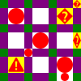

# Automatic Width/Height Tile Test

## Input:

* [ASCII mapping file](auto.txt)
* [ASCII art](grid.asc)

```
+-+-+-?
|X| |?|
+-+-+-+
| |X| ?
+-X-+-+
| | |X|
+-+-+X+
```

## Output:

[SVG](grid.svg)



## Symbol behavior:

* `+`, `-`, and `|` symbols (the rectangles) have specified dimensions
  (to form a grid)
* `X` sets its width and height according to its column and row,
  but preserves its aspect ratio (because `preserveAspectRatio="xMidYMid"`
  is the SVG default).
* `?` (the built-in undefined symbol) sets its width and height according
  to its column and row, and allows for nonuniform scaling
  (via `preserveAspectRatio="none"`).
