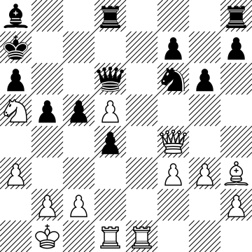

# Chess Boards

## Drawings

| Rendering | Repo Files | Source |
|-----------|------------|--------|
|  | [ASCII input](board-init.asc) [SVG output](board-init.svg) | [Wikipedia: Chess](https://en.wikipedia.org/wiki/Chess) |
|  | [ASCII input](board-immortal.asc) [SVG output](board-immortal.svg) | [Wikipedia: Immortal Game](https://en.wikipedia.org/wiki/Immortal_Game) (last position) |
|  | [ASCII input](board-kasparov-immortal.asc) [SVG output](board-karparov-immortal.svg) | [Wikipedia: Karparov's Immortal](https://en.wikipedia.org/wiki/Kasparov%27s_Immortal) (last position) |

## Drawings with Attack Graph

| Rendering | Repo Files | Source |
|-----------|------------|--------|
|  | [ASCII input](board-init.asc) [SVG output](board-init.svg) | [Wikipedia: Chess](https://en.wikipedia.org/wiki/Chess) |
|  | [ASCII input](board-immortal.asc) [SVG output](board-immortal.svg) | [Wikipedia: Immortal Game](https://en.wikipedia.org/wiki/Immortal_Game) (last position) |
|  | [ASCII input](board-kasparov-immortal.asc) [SVG output](board-karparov-immortal.svg) | [Wikipedia: Karparov's Immortal](https://en.wikipedia.org/wiki/Kasparov%27s_Immortal) (last position) |

## Mapping

* [CoffeeScript mapping file](map.coffee) and equivalent
  [JavaScript mapping file](map.jsx), illustrating:
  * Computing the square parity to automatically shade dark squares
  * Using `require` to load and modify external SVG files
    (strip off unnecessary `<svg>` wrapper)
  * JSX notation for creating and composing symbols
  * `svgtiler.background` for rendering a background white rectangle
* [CoffeeScript file](graph.coffee) for rendering the graph of attacks,
  illustrating more advanced `svgtiler.postprocess` usage.

## Piece Shapes

Piece shapes are defined by unmodified SVGs from
[Wikimedia's Standard chess diagrams](https://commons.wikimedia.org/wiki/Standard_chess_diagram),
authored by [Cburnett](https://commons.wikimedia.org/wiki/User:Cburnett)
(Colin M.L. Burnett)
and licensed under [BSD license](https://opensource.org/licenses/BSD-3-Clause)
(among other licenses).

| Image | Repo file | Wikimedia link |
|-------|-----------|----------------|
|  | [Chess_bdt45.svg](Chess_bdt45.svg) | [Chess_bdt45.svg](https://commons.wikimedia.org/wiki/File:Chess_bdt45.svg) |
|  | [Chess_blt45.svg](Chess_blt45.svg) | [Chess_blt45.svg](https://commons.wikimedia.org/wiki/File:Chess_blt45.svg) |
|  | [Chess_kdt45.svg](Chess_kdt45.svg) | [Chess_kdt45.svg](https://commons.wikimedia.org/wiki/File:Chess_kdt45.svg) |
|  | [Chess_klt45.svg](Chess_klt45.svg) | [Chess_klt45.svg](https://commons.wikimedia.org/wiki/File:Chess_klt45.svg) |
|  | [Chess_ndt45.svg](Chess_ndt45.svg) | [Chess_ndt45.svg](https://commons.wikimedia.org/wiki/File:Chess_ndt45.svg) |
|  | [Chess_nlt45.svg](Chess_nlt45.svg) | [Chess_nlt45.svg](https://commons.wikimedia.org/wiki/File:Chess_nlt45.svg) |
|  | [Chess_pdt45.svg](Chess_pdt45.svg) | [Chess_pdt45.svg](https://commons.wikimedia.org/wiki/File:Chess_pdt45.svg) |
|  | [Chess_plt45.svg](Chess_plt45.svg) | [Chess_plt45.svg](https://commons.wikimedia.org/wiki/File:Chess_plt45.svg) |
|  | [Chess_qdt45.svg](Chess_qdt45.svg) | [Chess_qdt45.svg](https://commons.wikimedia.org/wiki/File:Chess_qdt45.svg) |
|  | [Chess_qlt45.svg](Chess_qlt45.svg) | [Chess_qlt45.svg](https://commons.wikimedia.org/wiki/File:Chess_qlt45.svg) |
|  | [Chess_rdt45.svg](Chess_rdt45.svg) | [Chess_rdt45.svg](https://commons.wikimedia.org/wiki/File:Chess_rdt45.svg) |
|  | [Chess_rlt45.svg](Chess_rlt45.svg) | [Chess_rlt45.svg](https://commons.wikimedia.org/wiki/File:Chess_rlt45.svg) |
