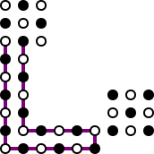
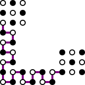

# Grid Graph Example

This example shows how to draw a ***grid graph***,
defined by a set of vertices with integer coordinates,
where edges usually connect all vertices at distance 1.
However, to enable drawing specific paths (e.g. Hamiltonian paths/cycles),
the edges are explicit in the ASCII input.

* [Mapping file](path.coffee)

## Fig. 2.7 from [Itai, Papadimitriou, and Szwarcfiter 1982](https://doi.org/10.1137/0211056)

| return path | cross path |
|:-----------:|:----------:|
|  |  |
| [ASCII input](ips_return_path.asc), [SVG output](ips_return_path.svg) | [ASCII input](ips_cross_path.asc), [SVG output](ips_cross_path.svg) |

## Fig. 2.8 from [Itai, Papadimitriou, and Szwarcfiter 1982](https://doi.org/10.1137/0211056)

* These examples use [flip_parity.js](flip_parity.js) to flip the parity of
the vertex coloring, to match the figure in the paper.

### Hamiltonian cycle

[ASCII input](ips_example_ham.asc), [SVG output](ips_example_ham.svg)

### Directed Hamiltonian cycle

* Illustrating the use of `svgtiler.def` to instantiate `<marker>`.

[ASCII input](ips_example_dir_ham.asc), [SVG output](ips_example_dir_ham.svg)

### Underlying graph

[ASCII input](ips_example_graph.asc), [SVG output](ips_example_graph.svg)
