# Super Mario Bros.

## Input:

* [CoffeeScript mapping file](mario.coffee)
* [JSON file](palette.coffee) to define which "palette" to use
  ("castle", "overworld", "underground", or "underwater")
* Sprites thanks to [The Spriters Resource](https://www.spriters-resource.com/nes/supermariobros/):

  | Palette     | Sprites   |
  | ----------- | --------- |
  | castle      | 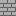 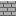      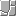
  | overworld   | 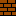 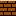 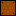     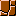
  | underground | 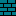 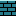    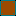  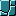
  | underwater  | 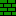 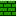 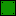   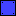  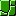
  | (general)   |       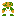 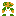  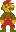  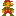  

* [Tab-separated data](door.tsv) for door gadget from the paper
  "[Super Mario Bros. is Harder/Easier than We Thought](http://erikdemaine.org/papers/Mario_FUN2016/paper.pdf)"
  (Figure 6 on page 12):

  | 0 | 1 | 2 | 3 | 4 | 5 | 6 | 7 | 8 | 9 | 10 | 11 | 12 | 13 | 14 | 15 | 16 |
  | ------ | ------ | ------ | ------ | ------ | ------ | ------ | ------ | ------ | ------ | ------ | ------ | ------ | ------ | ------ | ------ | ------ |
  | raised | raised | raised | raised | raised | raised | raised | raised | raised | raised | raised | raised | raised | raised | raised | raised | raised |
  |  |  |  |  |  |  |  | raised | raised | raised |  |  |  |  |  |  |  |
  | raised | raised | raised | raised | raised | raised |  |  | raised |  |  | raised | raised | raised | raised | raised | raised |
  | raised | raised |  |  |  | raised | raised |  | ,fire_se |  | raised | raised |  |  |  | raised | raised |
  | ,mario_small_right+4 |  |  | raised |  |  |  |  | raised |  | ,spiny_right+8 |  |  | raised |  |  | raised |
  | raised | raised | raised | raised | raised | raised | raised | brick,fire_se | raised | brick,fire_se | raised | raised | raised | raised | raised |  |  |
  |  |  |  |  |  |  |  |  | raised |  |  |  |  |  |  |  | raised |
  | raised | raised | raised | raised | raised | raised | raised | raised | raised | raised | raised | raised | raised | raised | raised | raised | raised |

## Output:

  | Palette     | PNG                       | SVG                       |
  | ----------- | ------------------------- | ------------------------- |
  | castle      | 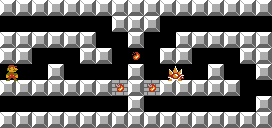      |       |
  | overworld   |    | 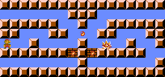   |
  | underground | 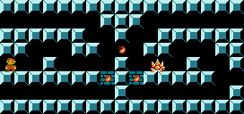 |  |
  | underwater  |   | 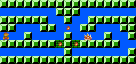  |
