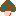
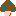
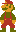
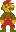
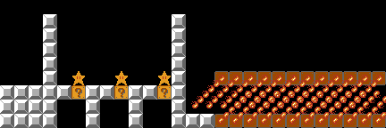
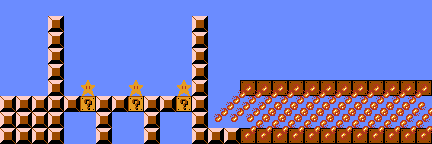
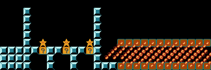
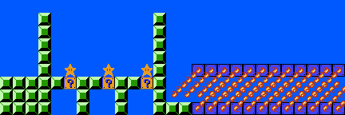

# Super Mario Bros.

## Mapping Input:

* [CoffeeScript mapping file](mario.coffee)
* [JSON file](palette.coffee) to define which "palette" to use
  ("castle", "overworld", "underground", or "underwater")
* Sprites thanks to [The Spriters Resource](https://www.spriters-resource.com/nes/supermariobros/):

  | Palette     | Sprites   |
  | ----------- | --------- |
  | castle      |         
  | overworld   |         
  | underground |         
  | underwater  |         
  | (general)   |                 

## Door Gadget:

**Input:** [Tab-separated drawing](door.tsv) for door gadget from the paper
"[Super Mario Bros. is Harder/Easier than We Thought](https://erikdemaine.org/papers/Mario_FUN2016/)"
(Figure 6 on page 12):

| 0 | 1 | 2 | 3 | 4 | 5 | 6 | 7 | 8 | 9 | 10 | 11 | 12 | 13 | 14 | 15 | 16 |
| ------ | ------ | ------ | ------ | ------ | ------ | ------ | ------ | ------ | ------ | ------ | ------ | ------ | ------ | ------ | ------ | ------ |
| raised | raised | raised | raised | raised | raised | raised | raised | raised | raised | raised | raised | raised | raised | raised | raised | raised |
|  |  |  |  |  |  |  | raised | raised | raised |  |  |  |  |  |  |  |
| raised | raised | raised | raised | raised | raised |  |  | raised |  |  | raised | raised | raised | raised | raised | raised |
| raised | raised |  |  |  | raised | raised |  | ,fire_se |  | raised | raised |  |  |  | raised | raised |
| ,mario_small_right+4 |  |  | raised |  |  |  |  | raised |  | ,spiny_right+8 |  |  | raised |  |  | raised |
| raised | raised | raised | raised | raised | raised | raised | brick,fire_se | raised | brick,fire_se | raised | raised | raised | raised | raised |  |  |
|  |  |  |  |  |  |  |  | raised |  |  |  |  |  |  |  | raised |
| raised | raised | raised | raised | raised | raised | raised | raised | raised | raised | raised | raised | raised | raised | raised | raised | raised |

**Output:**

| Palette     | PNG                       | SVG                       |
| ----------- | ------------------------- | ------------------------- |
| castle      |       |       |
| overworld   |    |    |
| underground |  |  |
| underwater  |   |   |

## Clause Gadget:

**Input:** [Tab-separated drawing](clause.tsv) for clause gadget from the paper
"[Classic Nintendo Games are (Computationally) Hard](https://erikdemaine.org/papers/Nintendo_TCS/)"
(Figure 11 on page 11), with stars added to show the question block contents:

| 0 | 1 | 2 | 3 | 4 | 5 | 6 | 7 | 8 | 9 | 10 | 11 | 12 | 13 | 14 | 15 | 16 |
| ------ | ------ | ------ | ------ | ------ | ------ | ------ | ------ | ------ | ------ | ------ | ------ | ------ | ------ | ------ | ------ | ------ |
| blank |  |  |  |  |  |  |  |  |  |  |  |  |  |  |  |  |  |  |  |  |  |  |  |  |  |  |
|  |  |  | raised |  |  |  |  |  |  |  |  | raised |  |  |  |  |  |  |  |  |  |  |  |  |  |  |
|  |  |  | raised |  |  |  |  |  |  |  |  | raised |  |  |  |  |  |  |  |  |  |  |  |  |  |  |
|  |  |  | raised |  |  |  |  |  |  |  |  | raised |  |  |  |  |  |  |  |  |  |  |  |  |  |  |
|  |  |  | raised |  |  |  |  |  |  |  |  | raised |  |  |  |  |  |  |  |  |  |  |  |  |  |  |
|  |  |  | raised |  | star |  |  | star |  |  | star | raised |  |  | question_used,fire_se-6+6*6 | question_used,fire_se-6+6*6 | question_used,fire_se-6+6*6 | question_used,fire_se-6+6*6 | question_used,fire_se-6+6*6 | question_used,fire_se-6+6*6 | question_used,fire_se-6+6*6 | question_used,fire_se-6+6*6 | question_used,fire_se-6+6*6 | question_used,fire_se-6+6*6 | question_used,fire_se-6+6*6 | question_used,fire_se-6+6*6 |
| raised | raised | raised | raised | raised | question | raised | raised | question | raised | raised | question | raised |  |  |  |  |  |  |  |  |  |  |  |  |  |  |
| raised | raised | raised | raised |  |  | raised |  |  | raised |  |  | raised |  |  |  |  |  |  |  |  |  |  |  |  |  |  |
| raised | raised | raised | raised |  |  | raised |  |  | raised |  |  | raised | raised | raised | question_used,fire_nw+6-6*6 | question_used,fire_nw+6-6*6 | question_used,fire_nw+6-6*6 | question_used,fire_nw+6-6*6 | question_used,fire_nw+6-6*6 | question_used,fire_nw+6-6*6 | question_used,fire_nw+6-6*6 | question_used,fire_nw+6-6*6 | question_used,fire_nw+6-6*6 | question_used,fire_nw+6-6*6 | question_used,fire_nw+6-6*6 | question_used,fire_nw+6-6*6 |

**Output:**

| Palette     | PNG                       | SVG                       |
| ----------- | ------------------------- | ------------------------- |
| castle      |       |       |
| overworld   |    |    |
| underground |  |  |
| underwater  |   |   |
