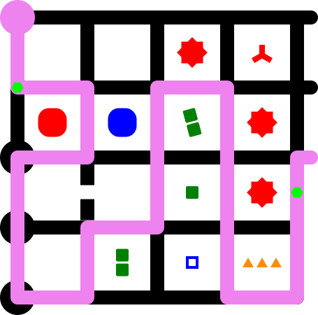
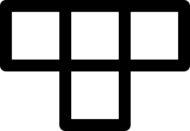

# The Witness Example

This SVG Tiler mapping file was originally created for the paper
"**[Who witnesses The Witness?  Finding witnesses in The Witness is hard
and sometimes impossible](https://erikdemaine.org/papers/Witness_TCS/)**"
by Zachary Abel, Jeffrey Bosboom, Michael Coulombe, Erik D. Demaine,
Linus Hamilton, Adam Hesterberg, Justin Kopinsky, Jayson Lynch, Mikhail Rudoy,
and Clemens Thielen.
In fact, this SVG Tiler was originally created to enable these figures,
and the two evolved extensively together in the early days.

## [`witness.coffee` Mapping File](witness.coffee)

## Examples

### Figure 2 from [Who witnesses The Witness?](https://erikdemaine.org/papers/Witness_TCS/)

A small puzzle featuring all clue types (not from the actual video game).

| Unsolved | Solved |
|:---:|:---:|
|  |  |
| [TSV input](everything_unsolved.tsv), [SVG output](everything_unsolved.svg) | [TSV input](everything_solved.tsv), [SVG output](everything_solved.svg) |

### Squares

One of the introductory square puzzles from the video game
(with colors changed).

| Unsolved | Solved |
|:---:|:---:|
|  |  |
| [TSV input](squares_unsolved.tsv), [SVG output](squares_unsolved.svg) | [TSV input](squares_solved.tsv), [SVG output](squares_solved.svg) |

### Triangles

A simple triangles puzzle (not from the actual video game).

| Unsolved | Solved |
|:---:|:---:|
|  |  |
| [TSV input](triangles_unsolved.tsv), [SVG output](triangles_unsolved.svg) | [TSV input](triangles_solved.tsv), [SVG output](triangles_solved.svg) |

### Just Grids

Simple tests of the grid functionality, including nonrectangular.

| Rectangular | Non-rectangular |
|:---:|:---:|
|  |  |
| [ASCII input](grid.asc), [SVG output](grid.svg) | [TSV input](nonrect.asc), [SVG output](nonrect.svg) |
